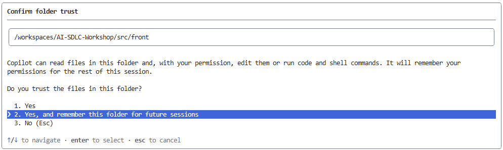
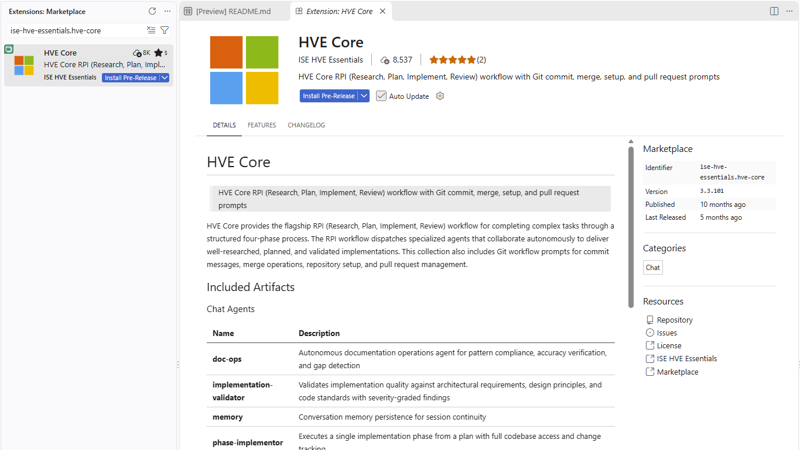
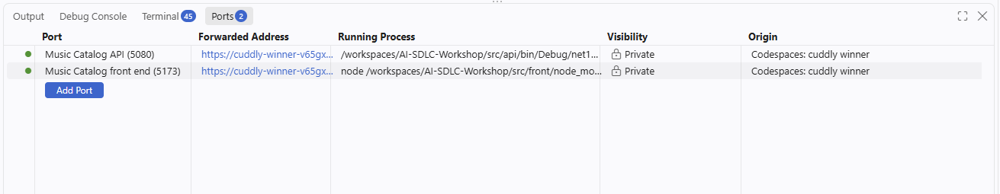

# AI SDLC with GitHub and GitHub Copilot

*Version 1.0 - September 2026*

Welcome to this workshop. It follows **GitHub Copilot Zero to Hero**: there you used Copilot primitives one at a time. Here you combine them into a governed, AI-assisted software development lifecycle (SDLC) for a real repository.

Build a small Music Catalog feature: browse tracks and add them to **one in-memory playlist**, with duplicate rejection and a visible empty state. Then share the method, automate surrounding work, and review a delegated change.

<details>
<summary>How the afternoon connects the SDLC stages</summary>

You will go from an idea to a merged change and then automate the work around it. The afternoon tells one story in three acts:

1. **Build the feature.**
   - Frame a deliberately small capability with the HVE-Core **Design Thinking Coach**.
   - Implement it with the **RPI** workflow (Research, Plan, Implement, Review), and make one real design decision at the review gate.
2. **Scale the method that built it.**
   - Make the method repository-owned and governed with **APM** and policy.
   - Compare that with discovering capabilities in a Copilot **plugin marketplace**.
   - Reconcile issues with committed planning and delivery evidence using **GitHub Agentic Workflows (gh-aw)**.
3. **Close the loop.**
   - Delegate one scoped RPI issue to **Copilot cloud agent** (formerly Copilot coding agent), behind a test contract.
   - Review its pull request with required checks and a separate Copilot code review.

The recap turns this into an operating model, then looks at it as an architect would: org rollout, measuring impact, brownfield adoption, and choosing a method and a model.

The shared application is the Music Catalog starter. It has a React + TypeScript + Vite front end in `src\front`, a .NET 10 minimal API in `src\api`, xUnit API tests in `tests\api`, and synthetic seed data in `src\api\Data\tracks.json`. The capability for today is fixed: **browse tracks and add tracks to a single in-memory playlist**. Duplicate adds are rejected. The empty playlist state is visible.

</details>

<div class="task" data-title="How to read this lab">

> Each level starts with a short **Topic**, then actions with observable checkpoints where needed. Expand optional explanations for more background; required actions and warnings stay visible. Copy-paste prompts are in code blocks. Reference solutions are in `solutions\afternoon-2`. Commit reviewed changes when a step calls for it.

</div>

<div class="warning" data-title="Product evolution">

> GitHub Copilot, Copilot CLI, HVE-Core, APM, Agent Plugins, gh-aw, and Copilot cloud agent evolve quickly. Screens, labels, commands, and availability may change after this workshop is written. When a feature looks different, check the current documentation linked in the relevant section and adapt without changing the learning objective.

</div>

## 🎓 Key concepts

You can start the lab without reading the full reference below. Return to it when a term is unfamiliar.

<details>
<summary>Reference: Copilot primitives, HVE, APM, workflows, and trust</summary>

### Copilot primitives (recap from GitHub Copilot Zero to Hero)

Primitives are the building blocks that you combine in this lab:

| Primitive | What it carries | Where it lives |
| --- | --- | --- |
| [Custom instructions](https://docs.github.com/en/copilot/how-tos/configure-custom-instructions/add-repository-instructions) | Always-on conventions | `.github\copilot-instructions.md`, `*.instructions.md` |
| [Prompt files](https://code.visualstudio.com/docs/copilot/customization/prompt-files) | Reusable tasks you invoke by name | `*.prompt.md` |
| [Custom agents](https://code.visualstudio.com/docs/copilot/customization/custom-agents) | A persona with its own tools and rules | `*.agent.md` |
| [Agent skills](https://docs.github.com/en/copilot/concepts/agents/about-agent-skills) | Task knowledge loaded on demand | `skills\<name>\SKILL.md` |
| [MCP servers](https://code.visualstudio.com/docs/copilot/customization/mcp-servers) | External tools and data | `mcp.json` |
| [Plugins](https://code.visualstudio.com/docs/copilot/customization/agent-plugins) and [marketplaces](https://docs.github.com/en/copilot/how-tos/copilot-cli/customize-copilot/plugins-finding-installing) | A bundle of primitives and a catalogue to share it | `plugin.json`, `marketplace.json` |

Principle: **context is the product**. The quality of an agent's output depends on the context that you give it. Primitives make that context explicit, reviewable, and versioned.

### HVE and HVE-Core

[HVE-Core](https://microsoft.github.io/hve-core/) (Hypervelocity Engineering Core) is an open-source, opinionated agentic SDLC framework from Microsoft. It ships agents, prompts, instructions, and skills as a Copilot plugin. Its central principle is **"AI carries the rules, humans keep the judgment."**

- **Design Thinking Coach**: guides a team through the problem space before any code is written: scope, research, synthesis, then ideas.
- **RPI (Research → Plan → Implement → Review)**: separates finding facts, deciding, changing code, and verifying. Each phase writes an artifact that a human can review, and each phase starts from a clean context.
- HVE-Core describes itself as *rapidly evolving*. Treat it as a source of patterns, and pin the version that you use.

### APM (Agent Package Manager)

[APM](https://microsoft.github.io/apm/) is a dependency manager for agent context. It applies the `package.json` model to agent context.

- `apm.yml` declares the skills, prompts, instructions, plugins, and MCP servers that a repository needs.
- The **lockfile** pins exact versions, so every developer and CI run gets the same context.
- **Policy** and `apm audit` restrict allowed sources, executable components, and MCP servers at enterprise, organization, or repository level.
- Principle: agent context is part of your **software supply chain**. Review, version, and govern it like code.

### GitHub Agentic Workflows (gh-aw)

[gh-aw](https://github.github.com/gh-aw/) lets you write repository automation in Markdown and run it as GitHub Actions. It is part of the GitHub Next [Continuous AI](https://githubnext.com/projects/continuous-ai) research.

- You write `*.md` and compile it to a `*.lock.yml` that Actions runs. Commit both files.
- The agent runs with **read-only permissions**. Writes such as issues, comments, and pull requests go through declared **safe outputs**.
- Principle: put automation on a schedule or an event, but keep strong guardrails and keep humans in the loop.

### Copilot cloud agent (formerly coding agent)

[Copilot cloud agent](https://docs.github.com/en/copilot/concepts/agents/cloud-agent/about-cloud-agent) works on an issue in its own GitHub Actions environment and opens a pull request for review.

- `copilot-setup-steps.yml` prepares its environment. Repository instructions and custom agents shape its behaviour.
- Branch protection, required reviews, and CI remain the gates. The agent proposes the change and humans approve it.
- By default, the agent checks its own changes with CodeQL, the GitHub Advisory Database, secret scanning and Copilot code review before it completes the pull request ([risks and mitigations](https://docs.github.com/en/copilot/concepts/agents/cloud-agent/risks-and-mitigations)).

### Copilot code review and secret scanning

- [Copilot code review](https://docs.github.com/en/copilot/concepts/agents/code-review) reviews a pull request like a human reviewer. It reads the repository custom instructions, such as `.github/copilot-instructions.md`, from the pull request's head branch.
- [Secret scanning](https://docs.github.com/en/code-security/secret-scanning/introduction/about-secret-scanning) detects credentials in the Git history. [Push protection](https://docs.github.com/en/code-security/secret-scanning/introduction/about-push-protection) blocks a push that contains a secret before it reaches the repository.
- Both act on pull requests and pushes. They review agent output in the same way as human output.

### Context, verification and trust

Three ideas connect the levels. Each one gets a short segment where it matters.

- **Context engineering** (Level 3): an agent only knows what is in its context window. Layered instructions, skills loaded on demand, and phase artifacts written to disk keep that context small and reviewable.
- **Verification as contract** (Levels 5 and 6): tests, CI and branch rulesets define "done". The same checks apply to your commits and to an agent's pull request.
- **Agentic threat model** (Levels 5 and 6): an agent that runs without you reads text that other people wrote. Read-only permissions, safe outputs, the agent firewall and narrow tokens limit what that text can make it do.

### Further reading

- [Customize Copilot in VS Code (overview)](https://code.visualstudio.com/docs/copilot/customization/overview)
- [GitHub Copilot CLI](https://docs.github.com/en/copilot/how-tos/copilot-cli)
- [HVE-Core repository](https://github.com/microsoft/hve-core)
- [Customize the Copilot cloud agent environment](https://docs.github.com/en/copilot/how-tos/copilot-on-github/customize-copilot/customize-cloud-agent)
- [Model Context Protocol](https://modelcontextprotocol.io/)
- [Copilot billing and usage](https://docs.github.com/en/copilot/concepts/billing-and-usage)

</details>

## 🚀 Dev Environment Setup

To complete this lab, you need:

- A GitHub account with a GitHub Copilot licence. Business or Enterprise is recommended. Copilot cloud agent, plugins, and gh-aw may need administrator enablement. See the [full prerequisites checklist](https://github.com/Justrebl/AI-SDLC-Workshop/blob/main/docs/prerequisites.md) for the policy, licence, and administrator checks, or the checklist for your delivery option: [Codespaces](https://github.com/Justrebl/AI-SDLC-Workshop/blob/main/docs/before-d-day-codespace.md), [local dev container](https://github.com/Justrebl/AI-SDLC-Workshop/blob/main/docs/before-d-day-devcontainer.md) or [local tools](https://github.com/Justrebl/AI-SDLC-Workshop/blob/main/docs/before-d-day-local.md).
- **Your own repository** created from the workshop template. Level 4 publishes repository agents, Level 5 runs a bounded workflow and assigns an issue to Copilot cloud agent, and Level 6 reviews its pull request, so the repository must belong to you.

Create your repository from the template: open [Justrebl/AI-SDLC-Workshop](https://github.com/Justrebl/AI-SDLC-Workshop), select **Use this template** → **Create a new repository**, and choose a **private** repository under your account. [Learn more about template repositories](https://docs.github.com/en/repositories/creating-and-managing-repositories/creating-a-repository-from-a-template).

<details>
<summary>Create the repository with GitHub CLI, or use the copy fallback</summary>

After signing in with `gh auth login`, replace `my-music-catalog` with any name:

```powershell
gh repo create my-music-catalog --private --template Justrebl/AI-SDLC-Workshop --clone
cd my-music-catalog
```

If template creation is blocked in your organization, copy the repository with a fresh history. Run these commands only in the new copy:

```powershell
git clone https://github.com/Justrebl/AI-SDLC-Workshop my-music-catalog
cd my-music-catalog
Remove-Item -Recurse -Force .git
git init -b main; git add -A; git commit -m "Workshop starter"
gh repo create my-music-catalog --private --source . --remote origin --push
```

`gh repo view` should show your own repository with a `main` branch. If the push is rejected for missing the `workflow` scope, follow the tip in Level 5 "Push your branch", then run `git push -u origin main`.

</details>

The repository ships a [dev container](https://code.visualstudio.com/docs/devcontainers/containers) based on a **prebuilt image**. The image already contains Git, Node.js 22, .NET 10, GitHub CLI, Copilot CLI, and APM CLI. On first start, the dev container installs the gh-aw extension and restores the API and front-end dependencies.

Choose one of the following three options.

### 🥇 Option 1: Pre-configured GitHub Codespace

Use this option if you want everything ready in a browser or in VS Code, with nothing to install.

1. In your new repository, select **<> Code** → **Codespaces** → **+** (Create codespace on main). See [Creating a codespace](https://docs.github.com/en/codespaces/developing-in-a-codespace/creating-a-codespace-for-a-repository).
2. Wait for the `postCreateCommand` to finish in the terminal.

<div class="info" data-title="Codespaces usage">

> Codespaces usage is billed or counted against your included quota, depending on your account. Check [GitHub Codespaces billing](https://docs.github.com/en/billing/concepts/product-billing/github-codespaces), and stop or delete your codespace after the workshop.

</div>

### 🥈 Option 2: Local dev container

Use this option if you prefer to work locally with the same tooling as the codespace.

1. Install [Git](https://git-scm.com/downloads), [Docker Desktop](https://www.docker.com/products/docker-desktop/), and [VS Code](https://code.visualstudio.com/download) with the **Dev Containers** extension.
2. Clone your repository and open it in VS Code.
3. Run **Dev Containers: Reopen in Container** from the Command Palette.

### 🥉 Option 3: Local environment

Use this option if you cannot run containers. Install:

| Tool | Why |
| --- | --- |
| [Git](https://git-scm.com/downloads) | Checkpoint commits and APM dependency resolution |
| [VS Code](https://code.visualstudio.com/download) + GitHub Copilot Chat | Local agent work |
| [Node.js 22 LTS](https://nodejs.org/en/download) | Vite + React front end, and Copilot CLI |
| [.NET 10 SDK](https://dotnet.microsoft.com/download/dotnet/10.0) | Minimal API and xUnit tests |
| [GitHub CLI](https://cli.github.com/) | Repository operations and gh-aw |
| [Copilot CLI](https://docs.github.com/en/copilot/how-tos/copilot-cli/set-up-copilot-cli/install-copilot-cli) | HVE-Core plugin and marketplace exercises |
| [APM CLI](https://microsoft.github.io/apm/getting-started/installation/) | Repository-owned HVE-Core dependency and policy audit |

Then clone your repository, run `gh extension install github/gh-aw`, `dotnet restore`, and `npm --prefix src\front ci`.

<div class="tip" data-title="Recommendation">

> Use Option 1 when you can. It saves setup time and gives the same environment to every participant and to the workshop tester.

</div>

## 🔐 Sign in and check your tools

From your workshop repository root, sign in to GitHub CLI, and then to Copilot CLI. Copilot CLI asks you to run `/login` on first start.

```bash
gh auth login
copilot
> `From Copilot` : exit
```

If **Confirm folder trust** appears, check that the displayed path is your workshop repository. Select **Yes** for this session, or **Yes, and remember this folder for future sessions** if you want to retain that trust, then press **Enter**. Choose **No (Esc)** if the path is unexpected or you do not trust the files. The screenshot shows a session started from `src/front`; use the repository root for the workshop.



Check the installed tool versions before starting the exercises. These commands report availability; they do not install or update anything:

```bash
git --version
node --version
dotnet --version
gh --version
copilot --version
apm --version
gh aw version
```

<details>
<summary>📚 Toggle solution</summary>

If a command is missing:

- In a codespace or dev container, run **Codespaces: Rebuild Container** or **Dev Containers: Rebuild Container**.
- Locally, reinstall the tool from the table in Option 3. Then open a new terminal so that `PATH` is refreshed.
- If `gh aw version` fails, run `gh extension install github/gh-aw`.

</details>

## Starter readiness (prerequisite)

Complete this once before the workshop, after opening your copy and restoring its dependencies. If you already completed these checks, go straight to Level 1; there is no separate app-validation level.

From the repository root, check both test suites and the working tree:

```powershell
dotnet test
npm --prefix src/front test
git status
```

Success Criteria:
- xUnit and Vitest pass.
- The working tree is clean before agents edit the repository. A fresh template copy already has an initial commit; no extra baseline commit is needed.
- The starter only serves and displays `/api/hello`. The 12 synthetic tracks in `src\api\Data\tracks.json` are not exposed by an endpoint yet, and the playlist capability is not implemented.

The application lives in `src\api` and `src\front`, with API tests in `tests\api` and reference solutions in `solutions\afternoon-2`. If a check fails, resolve it using your [delivery-option prerequisites](https://github.com/Justrebl/AI-SDLC-Workshop/blob/main/docs/prerequisites.md) before starting Level 1.


<div class="info" data-title="Documented capability labels">

> This workshop labels mechanisms as **documented capability**, **configuration**, **experimental**, **architectural recommendation**, or **workshop simulation**. Keep those labels when you adapt the material so participants do not confuse a verified product feature with a teaching pattern.

</div>

<div class="important" data-title="Synthetic data only">

> The 12 tracks in `src\api\Data\tracks.json` are synthetic sample data. Do not paste customer data, confidential backlog items, credentials, or production telemetry into prompts, issues, workflow runs, screenshots, or plugin manifests.

</div>


---

# Level 1: HVE orientation and HVE-Core CLI plugin

## Topic

Install HVE-Core as a personal Copilot CLI plugin and find DT Coach and RPI Agent for the next exercises.

**Why this level:** reuse a shared method instead of writing every agent's rules yourself. Level 4 will move that method into the repository for the team.


## Understand HVE-Core

HVE-Core is an opinionated agentic SDLC framework. Its published principle is: **AI carries the rules, humans keep the judgment.** In this workshop, HVE-Core is a methodology source, not a promise that every generated output is correct.

<details>
<summary>Which HVE agents the workshop uses</summary>

The core exercises use DT Coach, RPI Agent, Backlog Manager, Accessibility Reviewer, and Accessibility Planner. The extended tracks also use BRD Builder, PRD Builder, Functional Planner, Code Review, ADR Creator, and Security Reviewer.

In GitHub Copilot Zero to Hero, you wrote your own primitives. Here you install reusable agents, instructions, prompts, and skills for your own environment first; later levels address repository-owned context and team governance.

</details>

<div class="warning" data-title="Rapidly evolving framework">

> HVE-Core documentation describes it as rapidly evolving and best treated as a source of patterns and learning rather than a stable production dependency. Use it to structure work, then review and test like any other engineering output.

</div>

## Install the CLI plugin

### Step 1: Register the HVE-Core marketplace

Register HVE-Core's catalog so the CLI can resolve its plugin by name. Run from any terminal where `copilot` is available; if this marketplace is already registered, continue to installation:

```powershell
copilot plugin marketplace add microsoft/hve-core
```

Success Criteria:
- Copilot CLI registers the `hve-core` marketplace.

### Step 2: Install HVE-Core

Install HVE-Core's agents, prompts, and skills into your personal CLI environment. This package supplies the Research, Plan, Implement, Review method you will use later:

```powershell
copilot plugin install hve-core@hve-core
```

Success Criteria:
- The CLI reports that `hve-core` was installed successfully; it appears in the plugin view in the next step.

<div class="info" data-title="Documented capability">

> The two commands above come from the HVE-Core plugin documentation. HVE-Core instructions from plugins are not auto-applied as project instructions; project-level instructions still live in your repository.

</div>

### Step 3: Browse plugin commands

Open a repository-root CLI session to inspect the installed plugin before using it:

```powershell
copilot
```

Open the plugin view. HVE prompts use the `/hve-core:...` namespace; the later exercises select those entries from the slash-command menu:

```text
/plugin
```

Success Criteria:
- The plugin view lists HVE-Core, or the installed version's plugin help identifies how to open that list.
- `/hve-core:rpi-research` appears in the slash-command menu.

**For every HVE invocation:** type the short name, such as `/rpi-research`, select the matching HVE-Core entry, and press **Tab** to accept it. Add the task text before sending. Each block below shows the expanded `/hve-core:...` command and its prompt together as **one message**; do not submit the command line first. Built-in CLI commands such as `/agent <name>` and `/model auto intelligence` stay separate.

### Step 4: VS Code alternative

<div class="warning" data-title="Prefer the direct plugin">

> The direct HVE-Core Copilot CLI plugin is recommended: it is updated more often than the VS Code extension, which may lag behind the latest agents, commands, and skills. Use the extension as a fallback when the plugin path is blocked.

</div>

If the Copilot CLI plugin path is blocked, install the VS Code extension instead:

```text
ise-hve-essentials.hve-core
```

Success Criteria:
- DT Coach and RPI Agent appear in the VS Code Copilot Chat agent picker.



## Commit checkpoint

No repository file should change in this level. Run:

```powershell
git status
```

Success Criteria:
- Your working tree is still clean.

---

# Level 2: Design Thinking with DT Coach

## Scenario: Music Catalog

The starter is a small music-catalog application, not a streaming service. It currently displays a greeting from the API. Later, you will add catalog browsing and one in-memory playlist using synthetic tracks; no accounts or saved playlists are needed.

```text
src\
  api\
    Program.cs          ASP.NET Core API entry point: /api/hello
    Data\tracks.json    The synthetic track catalog
  front\
    src\App.tsx         React screen that currently reads /api/hello
    src\main.tsx        Front-end entry point
    vite.config.ts      Vite development server and /api proxy
```

## Topic

Start with a user problem, not a prescribed feature: how might someone choose music for a listening moment? DT Coach guides the exploration; you choose the context and ideas.

**Why this level:** experience HVE helping you think, not filling in predetermined answers. This **10–15 minute sampler is not completion of nine full methods**. Keep the exploration separate from the shared playlist coding exercise that follows.

<details>
<summary>How DT Coach and the planning agents support discovery</summary>

DT Coach supports nine methods: Methods 1–3 explore the problem, 4–6 explore possible solutions, and 7–9 consider implementation, testing, and iteration. You will plan or simulate the activities that need more time, real users, or working prototypes. These shortcuts do not satisfy the full methods' evidence gates.

An extended Product Manager track then turns these decisions into a BRD, a PRD, and GitHub issues with the HVE-Core planning agents.

### Let HVE carry the procedure

Give each specialist the goal, known facts, constraints, and relevant artifact. Let its HVE instructions, skills, templates, and quality gates do the structuring. Do not supply a document outline, grading rubric, or coding recipe just to make the output look right.

| Stage | Capability to notice | Your contribution |
| --- | --- | --- |
| **DT Coach** | Questions and challenges assumptions, maintains coaching state, and checks method readiness. | Share observations, explore ideas, and decide what needs real evidence. |
| **BRD Builder** | Links business needs to requirements and runs its own quality-review and handoff process. | Supply business facts, resolve questions, and review findings before approval. |
| **PRD Builder** | Derives testable product requirements from the reviewed inputs and checks coverage and quality. | Confirm the scope and judge unresolved questions or waivers. |
| **RPI** | Carries evidence through the plan, critique, implementation, validation, and acceptance review. | Make material decisions and inspect the returned artifacts. |

The copyable examples below are optional responses to actual questions, not a checklist of answers to force into the conversation. A missing-evidence warning or blocked handoff also demonstrates the framework's value; do not bypass it to match an example.

| Artifact | What it explains | What it is used for |
| --- | --- | --- |
| **BRD — Business Requirements Document** | Why the business needs a capability, who benefits, and which outcomes matter. | Align stakeholders on the need, value, and investment before defining a solution. |
| **PRD — Product Requirements Document** | What the product must do, its boundaries, and what counts as acceptable. | Give engineers, designers, and testers shared behaviour and acceptance criteria. |
| **GitHub issues** | The bounded work items that deliver the agreed requirements. | Track ownership, dependencies, and progress, with links back to the BRD and PRD. |

### BRD: why the business needs the capability

A **Business Requirements Document (BRD)** explains the problem worth solving, who benefits, and what a successful outcome would mean. It gives stakeholders a shared basis for deciding whether to invest in the work before the team commits to a solution.

A useful BRD records the business context, stakeholder and user needs, intended outcomes, scope, constraints, assumptions, risks, and unresolved questions. It distinguishes evidence from hypotheses: an agent must not invent customer interviews, adoption figures, or a return on investment. Success measures need stakeholder agreement; writing a metric into a document does not validate it.

For this synthetic Music Catalog exercise, the BRD explains why participants need a small, bounded playlist capability to practise a governed agentic delivery workflow. It records the learning context and the single-playlist, in-memory boundary. It does **not** claim that real customers have requested the feature or that it will generate revenue.

Use the BRD to align sponsors and stakeholders, compare proposed scope with the agreed need, and revisit the rationale when priorities change. It is not a technical implementation plan or a collection of coding tasks.

### PRD: what the product must do

A **Product Requirements Document (PRD)** turns the agreed business need into a clear description of the product behaviour. It answers what users should be able to do, which states and failure cases must be handled, and how the team will decide that the capability is acceptable.

A useful PRD describes the user journey, functional requirements, relevant non-functional requirements such as accessibility, acceptance criteria, dependencies, and explicit exclusions. It should be detailed enough for engineers, designers, and testers to work from the same intent without unnecessarily prescribing the implementation.

For the playlist slice, the PRD specifies browsing tracks, adding a track to the single playlist, rejecting duplicate adds, displaying the empty state, and providing labelled, accessible controls. It also preserves the exclusions: no users, authentication, persistence, reorder, remove, search, or playlist creation. Those behaviours become acceptance criteria that the implementation and tests must satisfy.

Use the PRD to review proposed designs, plan delivery, derive test cases, and assess changes. It is not proof that a feature works: implementation, testing, and human review still provide that evidence. Architecture choices and the coding sequence belong in the subsequent technical plan or an architecture decision record when needed.

The chain is **framed need → BRD → PRD → reviewed backlog → implementation and validation**. Keep the documents proportional to the decision: this workshop uses short artifacts for a small slice, not paperwork for its own sake. If the scope changes, update the affected requirements and work items together rather than letting the backlog silently diverge from the agreed intent.

### How a Product Manager uses HVE principles

HVE-Core's principle is **"AI carries the rules, humans keep the judgment."** For a PM, this means delegating repeatable structuring and consistency work while retaining responsibility for the product decisions. The following is a practical interpretation for this workshop, not an additional HVE-Core policy.

1. **Frame before specifying.** Use DT Coach to make the problem, user need, assumptions, and boundaries explicit. In real product work, bring research and stakeholder evidence; the coach can organize that evidence but cannot substitute for it.
2. **Turn intent into reviewable artifacts.** Use BRD Builder and PRD Builder to draft structured requirements and surface gaps or contradictions. Review the drafts with the relevant stakeholders; generated text is a proposal, not approval.
3. **Make scope and success explicit.** Ask agents to preserve exclusions and produce observable acceptance criteria. The PM decides which outcomes matter, how to prioritize competing needs, and which trade-offs are acceptable.
4. **Separate planning from action.** Use Functional Planner to propose an issue hierarchy and Backlog Manager to recommend ordering and dependencies. Inspect the handoff before authorizing `/hve-core:backlog-execute` to create or change issues in the confirmed repository.
5. **Preserve traceability and curate the handoff.** Keep the reviewed BRD, PRD, and decisions linked to the backlog. Commit useful, agreed deliverables rather than raw agent conversations, sensitive meeting notes, or unsupported claims.
6. **Close the feedback loop.** Compare delivered behaviour and review findings with the PRD, then evaluate outcomes using actual evidence. Accept, reject, or revise follow-up work deliberately; passing tests does not by itself establish business value.

The PM's role therefore shifts from repeatedly formatting documents and tickets to checking evidence, resolving ambiguity, aligning stakeholders, and owning prioritization. HVE provides a repeatable path between those decisions and engineering work; it does not make the decisions authoritative merely because an agent produced them.

The [extended Product Manager track](#extended-track-product-manager-with-hve-core) demonstrates this handoff with BRD Builder, PRD Builder, Functional Planner, and Backlog Manager. It is optional: the core workshop proceeds with a reviewed implementation handoff after the open exploration.

</details>


## Start a DT project

### Step 1: Set Auto with the intelligence profile for the rest of the lab

Before starting the Design Thinking exercise, switch to **Auto** model selection with the **intelligence** profile. Keep this setting for the remaining interactive lab work, including the RPI phases.

In Copilot CLI, start `copilot` from the repository root and enter:

```text
/model auto intelligence
```

Confirm that **Auto** and the **intelligence** profile are selected. If your CLI version opens a selection menu instead, use `/model` to select **Auto** and its **intelligence** profile. You can also start a new session with the explicit runtime options:

```powershell
copilot --model auto --auto-tier intelligence
```

Auto chooses an available model allowed by your account and organization policies; it does not guarantee a particular model. This setting applies to your interactive session, not to separate cloud-agent or workflow runs. If you start a new session later, confirm the setting again.

If you use VS Code Chat, select **Auto** in the model picker and **intelligence** if your version offers the profile. If that profile is unavailable, use Copilot CLI for the workshop's Auto intelligence configuration.

### Step 2: Select DT Coach in Copilot CLI or VS Code Chat

Use the surface where you installed HVE-Core in Level 1.

**Copilot CLI:** there is no persistent agent-picker dropdown. In the session configured above, open the agent selection menu with:

```text
/agent dt-coach
```

If this opens a picker or the direct name is not recognized, run `/agent`, find **DT Coach** (it may appear as **DT-Coach** or a plugin-prefixed name), select it with the arrow keys, and press **Enter**. Confirm that DT Coach is the active agent before pasting the project prompt.

If your instructions refer to `/agents`, check `/help` for the command supported by your installed version; Copilot CLI 1.0.90-3 lists the singular `/agent`. If DT Coach is missing, check `/plugin` and complete the HVE-Core installation from Level 1 before continuing.

**VS Code Chat:** open Chat, use the agent picker, and select **DT Coach**. If it is missing, confirm that the HVE-Core extension is installed and enabled.

### Step 3: Start a learner-led nine-method sampler

Choose a listening situation you want to explore: a commute, focused work, a shared evening, or your own example. These are starting points, not personas or validated research. Set your own 10–15 minute timer; the coach cannot reliably enforce elapsed time.

Type `/dt-start-project`, select the HVE-Core project-start prompt, and press **Tab**. Then add the project brief below and send the whole message:

```text
/hve-core:dt-start-project.prompt

Project name: Music Catalog listening experience — a workshop demonstration POC.
Starting question: How might we help someone choose music for a listening moment?
Help me brainstorm and sample all nine HVE Design Thinking methods within a 10–15 minute learning exercise. I will manage the timer. Keep proposed specifications POC-sized: no authentication, database, persistence, or external services; retain the existing src/api and src/front setup.
```

This is a **workshop demonstration**, not a production product specification. Explore different ideas within the starter's simple ASP.NET Core API and React front end; do not propose replacing its architecture or adding infrastructure. DT coaching notes belong under `.copilot-tracking/dt/music-catalog-listening-experience/`, not directly under `.copilot-tracking/dt/`. No application implementation is requested at this stage.

**Now follow the chat for the next 10 minutes.** Read DT Coach's responses, answer its questions in your own words, contribute ideas, and ask follow-up questions. Do not just paste the brief and move to the next lab step: the conversation is the exercise. If time allows, continue up to 15 minutes, then use the recap in Step 4.

You do not need to prescribe the coach's process. Keep any working-note edits limited to `.copilot-tracking/`; application code, tests, and published documentation stay unchanged during exploration.

Success Criteria:
- You supply the user/context and make choices rather than accepting a prewritten feature definition.
- DT Coach guides small activities across the nine methods, or explicitly reports which were only previewed or not reached.
- It does not implement code.
- It separates your observations from assumptions, and proposed tests from actual results.
- Any agent-written working notes stay under the local, ignored `.copilot-tracking/` folder.

<div class="tip" data-title="Approve local working-note edits">

> If DT Coach requests permission to create or update its `.copilot-tracking/` notes, you may approve that edit for the session when your client offers the option. Check the requested path and permission scope first; prefer an approval limited to the tracking folder rather than all repository writes.
>
> DT Coach's write boundary remains `.copilot-tracking/` only. Decline requests to edit application code, tests, or published documentation during this exercise. **Auto intelligence selects the model; it does not grant write permissions.** Keep normal approval prompts and do not use unrestricted **allow-all / YOLO** permissions for this exercise.

</div>

### Example outcome after visiting all nine methods

This example explores a mood-based listening experience for hi-fi enthusiasts at home. The recap distinguishes **Methods 1–6 sampled** from **Methods 7–9 planned** and states that no method met its full completion criteria. Your context, ideas, and recap can differ; this is not an answer to reproduce or an expansion of the Level 3 implementation scope.


<details>
<summary>Toggle solution: example prompts for the nine methods</summary>

These nine prompts group and rephrase the conversation shown in the example. They are **illustrative learner contributions**, not nine official method commands or proof that the methods are complete. Start the project and send the short brief above first. Then use a prompt when the coach reaches the relevant method, adapting it to your own idea rather than pasting the whole sequence.

Let DT Coach choose its questions and activities. The example supplies a listener's context and choices; it does not replace the coach's method instructions or require a particular artifact shape.

**1. Scope Conversations — choose the listener and context**

```text
I would like to explore the experience of tech-savvy hi-fi enthusiasts listening at home. They choose music as they go and want to start listening immediately, then add upcoming tracks during the session. Help me clarify their goal without assuming the solution.
```

**2. Design Research — distinguish observations from assumptions**

```text
I have not identified a major frustration yet; I am exploring ways to modernize the experience. Treat this as a hypothesis, not validated research. What would we ask or observe to understand how these listeners choose their next tracks?
```

**3. Input Synthesis — frame an opportunity**

```text
Help me turn that context into a focused opportunity: how might we help listeners see what is coming next and adapt the music to their current mood without interrupting playback? Separate what we know from what we still need to learn.
```

**4. Brainstorming — explore contrasting ideas**

```text
Let us explore several approaches before choosing one: a preview of upcoming tracks, a mood filter such as "upbeat songs only", voice controls, or smartwatch interaction. Help me compare these ideas and suggest a contrasting alternative.
```

**5. User Concepts — choose a direction**

```text
For this exploration, I would like to try a mood filter using simple song tags such as "upbeat", "chill", and "lounge". The listener could use a toggle or dropdown. Help me describe the short user journey and the main trade-off.
```

**6. Low-Fidelity Prototypes — sketch the behaviour**

```text
Sketch the interaction in text. Keep the current song playing when the mood changes. Dim and skip only upcoming tracks that do not match, and show a reason such as "Skipped: current mood is upbeat." Help me spot a confusing state in this flow.
```

**7. High-Fidelity Prototypes — plan what to prove**

```text
Do not build a functional prototype yet. Help me plan what one would need to prove. I would enter mood tags manually in song metadata for now; automatic tagging could be a future option. What technical assumptions should we test first?
```

**8. User Testing — prepare a test, not invented results**

```text
I have no functional prototype or real test results yet. I would like to learn how to test the mood selector without leading the listener. How should we prepare?
```

**9. Iteration at Scale — choose signals and recap**

```text
For a future experiment, consider simple thumbs-up or thumbs-down feedback and the proportion of listening sessions that use the mood filter. Help me define what those signals could tell us and when we should revisit the idea. Then recap what we actually tried, what was only planned, and what remains across all nine methods.
```

The example is a discovery direction, not a request to implement filtering, voice controls, smartwatch integration, or automatic tagging. Keep it in local coaching notes; the shared playlist handoff later in this level remains separate.

</details>

### Step 4: Experiment, challenge, and move between methods

Use the table as a route map, not nine prompts to paste at once. Spend more of your time generating and comparing ideas; keep later implementation and rollout work as plans.

| Method | Small activity you can try | What the shortcut does not establish |
| --- | --- | --- |
| 1. Scope Conversations | Choose a listener and situation; describe what feels difficult. | Stakeholder agreement or validated demand. |
| 2. Design Research | Share an observation, or ask what neutral question you would ask a listener. | Research that nobody conducted. |
| 3. Input Synthesis | Separate observations from assumptions and write a "How might we…" question. | A representative research synthesis. |
| 4. Brainstorming | Add your own ideas, request contrasting alternatives, and resist choosing immediately. | That the first plausible solution is the best one. |
| 5. User Concepts | Choose a concept and describe the listener's short journey and its trade-off. | User validation of that concept. |
| 6. Low-Fidelity Prototypes | Sketch the flow in text or on paper; notice a confusing state. | A working application. |
| 7. High-Fidelity Prototypes | Identify what a functional prototype would need to prove and plan it. | Technical feasibility; no hi-fi prototype is built here. |
| 8. User Testing | Ask a peer to walk through the sketch, or plan a neutral task and observation. | Full Method 8 testing of a functional prototype. |
| 9. Iteration at Scale | Choose a next experiment, success signal, and reason to revisit an earlier method. | Scaled rollout or measured impact. |

To assess where to go next, use DT Coach's **Method Next** handoff, or type `/dt-method-next`, select the HVE-Core entry, and press **Tab**. Add the request below before sending:

```text
/hve-core:dt-method-next.prompt

Assess project music-catalog-listening-experience and recommend the next method from its current coaching state.
```

Let it read the current project's coaching state and explain its recommendation. If it asks which project to use, provide `music-catalog-listening-experience` in a separate reply. It may recommend more work or a return to an earlier method; missing exit evidence is not permission to mark a method complete. In this sampler, ask for a preview of the remaining work when full progression is not justified.

Try saying **"Challenge my assumption"**, **"Give me a contrasting idea"**, or **"Let's revisit research"**. Before moving on, contribute an answer, decision, sketch, or question of your own. The nine methods are not a one-way checklist: discovering a weak assumption is a reason to revisit an earlier method.

When your timer ends, say **"Timebox: recap what we actually tried and preview what remains."** Do not rush through fabricated research or pretend you completed prototyping just to tick every method. If latency prevents nine interactive stops, keep the recap explicit about guided previews.

<div class="important" data-title="Workshop simulation">

> This is a compressed learning exercise, not validated customer research or a completed nine-method project. A fictional user response is a simulation, a text sketch is low fidelity, and a test plan is not a test result. The learner controls the exploration; the shared implementation contract below is a separate facilitator-owned constraint.

</div>

## Debrief and hand off to the shared implementation slice

Keep the ideas you explored with DT Coach. For Level 3, however, everyone builds the same small playlist feature so the coding exercise stays focused and comparable across the room.

**This feature is chosen for the workshop, not a result that your DT session must produce or validate.** Your explored concept does not have to be a playlist. Keep other ideas, such as mood filtering, for possible future work. You still choose how the interface handles duplicate adds at Level 3's plan gate.

### Step 1: Separate exploration from the implementation handoff

The following native HVE prompts are **optional for this workshop**. They support fuller DT projects and check the evidence needed for a formal handoff. You do not need one to continue from this short sampler to the shared coding exercise. Type `/hve-core:dt-` to discover the matching prompts in your client's slash-command menu.

- **`dt-handoff-problem-space.prompt`** packages completed Methods 1–3 discovery evidence for `/hve-core:rpi-research`.
- **`dt-handoff-solution-space.prompt`** packages completed Methods 4–6 concept and low-fidelity prototype evidence for `/hve-core:rpi-research`.
- **`dt-handoff-implementation-space.prompt`** packages completed Methods 7–9 technical, testing, and scaling evidence, plus earlier discovery lineage, for `/hve-core:rpi-research`.
- **`dt-canonical-deck.prompt`** creates or refreshes a canonical snapshot and can optionally build a presentation from available artifacts.
- **`dt-figma-export.prompt`** exports suitable artifacts to FigJam or Figma for collaborative review; it requires the Figma MCP server and permission to create the external file.

For an Implementation Space handoff, type `/dt-handoff-implementation-space`, select the matching HVE-Core prompt, and press **Tab**. Add your actual project slug before sending, for example:

```text
/hve-core:dt-handoff-implementation-space.prompt

Use project slug music-catalog-listening-experience for the Implementation Space handoff.
```

The prompt checks coaching state and readiness before producing a research-ready handoff. **Sampling a method is not completing it:** if no Implementation Space method is complete, resume coaching for a real handoff, or continue with the workshop-only recap below. Do not mark simulated tests or planned prototypes as completed evidence. An eligible handoff produces `handoff-summary-implementation-space.md` in your DT project folder and a research topic under `.copilot-tracking/research/`; it does not start implementation.

**For Level 3, build the playlist feature described below.** These requirements are supplied by the facilitator; you do not need to derive them from your DT exploration:

- **User-visible capability:** browse tracks and add them to one in-memory playlist.
- **API endpoints:** `GET /api/tracks`, `GET /api/playlist`, and `POST /api/playlist/tracks` with a JSON body containing `trackId`.
- **Front-end states:** visible catalog and playlist, with the empty-state text "Your playlist is empty. Add a track to get started."
- **Duplicate handling:** reject unknown track ids with HTTP 404 and duplicate adds with HTTP 409; make duplicate feedback visible and accessible, while leaving the UI approach open for the RPI plan gate.
- **Accessibility:** accessible, labelled controls and perceivable status feedback.
- **Out of scope:** users, authentication, persistence, reorder, remove, search, and playlist creation.

Now ask DT Coach to recap your exploration and keep the supplied coding scope separate from it. A formal DT handoff is not needed for this workshop recap:

```text
Summarize the final decisions from our Music Catalog listening-experience exploration, distinguishing evidence, assumptions, and planned work.
Separately recap the shared playlist delivery contract in docs/afternoon-2/workshop.md under "Debrief and hand off to the shared implementation slice". This is the common Level 3 coding exercise, not a result of our exploration. Leave the duplicate-feedback UX choice open.
Do not claim that sampling validated the concept or completed a method. Keep working notes under .copilot-tracking/ only.
```

Success Criteria:
- The recap preserves your exploration and its evidence limits.
- The common coding scope is kept separate from your explored concept, without changing the supplied requirements.

### Step 2: Review the recap and coding scope

Check that the recap reflects your conversation and that the coding scope matches the requirements above. Your broader ideas remain in the exploration recap; they do not need to fit the playlist exercise. Ask the coach to correct any misunderstanding. Keep assumptions and proposed experiments distinct from actual research or test results.

### Step 3: Explore the local coaching notes

DT Coach maintains its working state during the conversation; you do not need to send a separate save prompt. Once it has finished writing, expand `.copilot-tracking` > `dt` > your project folder in VS Code Explorer and inspect what it created.

The example below includes `coaching-state.md`, `sampler-recap.md`, `implementation-handoff.md`, and a Method 8 `test-plan.md`. Your files depend on the conversation and methods visited; these filenames are examples, not a required checklist. Open the coaching state and any recap or method notes that actually exist.


Open a coach-created note in Explorer to see how it captures your conversation. These are **local, ignored working notes**, not files to commit. The next step creates the shareable delivery brief; later, use VS Code's Source Control view to review the staged diff before committing that document.

### Step 4: Save the reviewed delivery brief

The coaching exercise ends here. Use HVE's **Documentation** agent to curate the shared delivery brief, rather than turning DT working notes into a committed artifact. In Copilot CLI, switch with:

```text
/agent hve-core:documentation
```

If the identifier is not recognized, use `/agent documentation` or choose **Documentation** from `/agent`. In VS Code, select **Documentation** in the agent picker. Then send:

```text
Write a curated Design Thinking decision record for the Music Catalog playlist slice to docs/project-planning/playlist-design-decisions.md.
Use author mode to create a short reference from the reviewed shared playlist delivery contract in docs/afternoon-2/workshop.md and the coach's recap. Do not present the exploration as validated research.
Keep private coaching notes and personal details out of the document. Limit published changes to this file.
```

Open the saved file and compare it with the reviewed contract. Correct differences before sharing it. This brief is the input for PRD Builder and Level 3, not a required reproduction of the coach's headings or filenames. Keep it uncommitted until [Curate what you commit](?step=2#curate-what-you-commit), where you review it with any BRD and PRD.


## Extended track: Product Manager with HVE-Core

<div class="info" data-title="Extended track">

> This track adds about 40 minutes. Your facilitator tells you whether the room runs it hands-on, watches it as a demo, or skips it. Level 3 works without it: if you skip it, go to [Curate what you commit](?step=2#curate-what-you-commit).

</div>

This track follows the HVE-Core [TPM guide](https://microsoft.github.io/hve-core/docs/hve-guide/roles/tpm) and [Business Program Manager guide](https://microsoft.github.io/hve-core/docs/hve-guide/roles/business-program-manager). You turn the decisions you just locked into requirement documents, then into a tracked backlog of GitHub issues. In Level 3, a developer picks up that backlog.

### The PM agent chain

Use the agents in this order:

| Order | Stage in the TPM guide | HVE-Core agent or command | What it produces | Writes to GitHub? |
| --- | --- | --- | --- | --- |
| 1 | Discovery | **DT Coach** (done above) | A framed problem and locked decisions | No |
| 2 | Discovery, optional | **Meeting Analyst** | Requirements extracted from Microsoft 365 meeting transcripts | No |
| 3 | Product definition | **BRD Builder** | A business requirements document (BRD) in `docs\project-planning` | No |
| 4 | Product definition | **PRD Builder** | A product requirements document (PRD) in `docs\project-planning` | No |
| 5 | Decomposition | **Functional Planner** | A GitHub issue hierarchy plan and a handoff file you can review | No, read-only |
| 6 | Execution | **Backlog Manager** or `/hve-core:backlog-execute` | GitHub issues and sub-issues | **Yes**, after you confirm |
| 7 | Sprint planning | **Backlog Manager** with `/hve-core:backlog-plan` | A recommended order and dependencies | No, read-only |

Why this order:

- **Why before what.** The BRD states the business need and who benefits. The PRD states what the product does and how to test it. The TPM guide recommends writing the BRD before creating any work item.
- **Planning is separate from writing.** Functional Planner and `/hve-core:backlog-plan` cannot change the tracker. Only `/hve-core:backlog-execute` writes to GitHub, and only after you review the handoff and confirm the repository.
- **One owner per role.** In the Business Program Manager guide (beta), a BPM stops at the BRD and user stories, then works with a TPM, who manages the issues. In this track, you play both roles.

<div class="important" data-title="Workshop simulation">

> The role guides and agent behaviour are documented by HVE-Core. The stakeholder facts, the short question rounds, and one person playing both PM roles are a workshop simulation. Agent output still needs your review before it reaches GitHub.

</div>

### Step 1: Prepare your Copilot surface

For this PM track, use **VS Code Copilot Chat in the workshop Codespace or dev container**, with HVE-Core from Level 1. Local VS Code setup without a dev container is deferred.

**Before using the backlog agents, connect the GitHub MCP server and verify its tools are available.** HVE-Core supplies the agents, not your GitHub authorization. This connection is needed for the optional PM track's GitHub operations, not for the core DT brainstorming exercise.

The repository's `.devcontainer.json` adds the **GitHub HTTP MCP server** automatically when the container is created. Do not add another server. If your container predates this configuration, rebuild it.

1. Run **MCP: List Servers**, select `github`, and choose **Start Server** if it is not running.
2. Review any trust prompt and complete GitHub sign-in if requested, using the account that can access your workshop repository.
3. In Copilot Chat, open **Configure Tools** and enable the GitHub tools needed for the backlog exercise.
4. Ask the agent to read your repository's open issues **without changing anything**. An empty list is fine; resolve any connection or permission error before continuing.

The container configures the server, not your permissions. Organization policies still apply, and you must review proposed writes before confirming them. Never paste credentials into chat or repository files. If the server fails to connect, use **Show Output** and share only the redacted error with the facilitator.

To switch agents in Copilot CLI, enter `/agent <agent-name>` using the command shown at each step below. If your plugin exposes a namespaced identifier or the direct name is not recognized, run `/agent` and choose the matching agent from the list. In VS Code, use the agent picker instead.

### Step 2 (facilitator demo, optional): Meeting Analyst

**Meeting Analyst** reads meeting transcripts from Microsoft 365 through the WorkIQ MCP server, extracts requirements, and hands off to PRD Builder. It needs a Microsoft 365 Copilot licence and WorkIQ, and it cannot read a local transcript file.

For this optional demo, run `/agent meeting-analyst` in Copilot CLI, or select **Meeting Analyst** in the VS Code agent picker.

The playlist slice has no real meetings, so attendees skip this step. The stakeholder facts in the next prompt stand in for a transcript.

### Step 3: Write the BRD

In Copilot CLI, switch to BRD Builder with this separate command; in VS Code, select **BRD Builder** in the agent picker:

```text
/agent brd-builder
```

Then send the business context below. The facts are inputs, not an outline the builder must reproduce:

```text
Create a business requirements document for the Music Catalog playlist slice.

Use only these facts. Do not invent stakeholders, metrics, or dates:
- Business problem: workshop participants need one small, realistic feature to practise a governed agentic SDLC end to end.
- Sponsor: the workshop facilitator. Users: workshop participants acting as listeners of a synthetic music catalog.
- Business objective: a listener can browse the catalog and collect tracks in a single playlist during a session.
- Success criteria: every participant ships the slice with passing tests during the workshop; a duplicate add is rejected with a visible message; the empty playlist state is visible; controls are accessible by role and label.
- Constraints: one playlist, in-memory state only, no users, authentication, persistence, reorder, remove, search, or playlist creation.
- Source: the locked Design Thinking decisions for this slice, captured in docs/project-planning/playlist-design-decisions.md.

Ask at most three clarifying questions, then write the BRD. Record anything you cannot confirm as an open question instead of guessing.
Save the BRD in docs/project-planning/music-catalog-playlist-slice-brd.md and confirm the saved file path.
```

Let BRD Builder guide its own Discover, Define, and Govern process. Answer its actual questions rather than requesting each section yourself. Notice how it links the supplied business facts to requirements, identifies gaps, and uses its quality reviewer before handoff. The three-question limit keeps the workshop bounded; it does not waive missing evidence or approval gates.

<details>
<summary>Toggle example: a step-by-step BRD conversation</summary>

This is a curated example, not a script for manufacturing approval. Send each message separately and wait for the agent's response. The starter above is step 1; do not send it twice. Steps 3–9 restate the supplied facts or clarify their limits: use them only if relevant to the agent's response, and combine them if it asks a grouped question. The three-question limit still applies; these messages are example contributions, not seven required clarifying questions.

**1. Start the BRD process.** Select BRD Builder with `/agent brd-builder` and send the starter prompt above.

**2. Acknowledge the disclaimer after reading it.**

```text
I understand the requirements-planning disclaimer. Continue.
```

**3. Explain the business problem.**

```text
Business problem: Workshop participants need one small, realistic feature to practise a governed agentic SDLC end to end.
```

**4. Identify the stakeholders.**

```text
Stakeholders: The sponsor is the workshop facilitator. Users are workshop participants acting as listeners of a synthetic music catalog. Do not add other stakeholders.
```

**5. State the objective.**

```text
Business objective: A listener can browse the catalog and collect tracks in a single playlist during a session.
```

**6. Confirm the success criteria without claiming they are already achieved.**

```text
Success criteria: Every participant ships the slice with passing tests during the workshop; a duplicate add is rejected with a visible message; the empty playlist state is visible; controls are accessible by role and label. These are acceptance targets, not observed results. Record any unconfirmed measurement details as open questions.
```

**7. Confirm the scope.**

```text
Scope and source: Use the locked Design Thinking decisions for the shared playlist slice, as defined by the facilitator-owned workshop contract. Keep mood filtering and other exploration ideas deferred; do not imply the sampler validated them.
```

**8. Confirm the constraints.**

```text
Constraints: One playlist, in-memory state only, and no users, authentication, persistence, reorder, remove, search, or playlist creation.
```

**9. Record the risks.**

```text
Risks: No additional risk facts were supplied. Mark any proposed risks as assumptions to review, and record unresolved questions without inventing owners, metrics, or dates.
```

**10. Inspect the draft produced by the builder.**

```text
Show the saved BRD draft and anything still preventing handoff.
```

**11. Review the summary and unresolved items.**

```text
Explain the quality-review findings and open questions so I can review the handoff.
```

**12. Approve the handoff only after inspecting the document.** Send this only if you accept the actual review findings:

```text
I have reviewed the saved BRD and approve its handoff to PRD Builder for this workshop POC. Preserve the supplied success criteria and any remaining open questions. Present any required waiver for my explicit approval; this is not production approval or a claim that the success criteria have already been achieved.
```

**13. Inspect the handoff evidence.**

```text
Show the handoff file path and sign-off status. Explain each waiver in one sentence and identify anything that still blocks the handoff.
```

The agent may maintain session and handoff metadata under `.copilot-tracking/`; the shareable BRD belongs in `docs/project-planning/`. A waiver is not a clean pass. If the review identifies unresolved gaps, inspect them and approve any waiver explicitly rather than asking the agent to force a particular status or version. The supplied success criteria remain in the BRD even when their achievement has not yet been demonstrated.

If the agent exceeds the clarification limit, send:

```text
Record unresolved details as open questions and proceed with the draft. Do not invent answers or bypass required review and approval gates.
```

</details>

**Check and share the saved result:** open `docs/project-planning/music-catalog-playlist-slice-brd.md` in Explorer (or the actual path confirmed by the agent). Verify the file exists and contains the reviewed problem, objectives, scope, constraints, risks, and open questions—not just a chat summary. Check that the shared playlist boundary is preserved and no invented metrics or customer validation appear. Ask for corrections before approving the handoff. Share this reviewed document with PRD Builder in Step 4; include it in the curated planning-document commit later in this level, not the private `.copilot-tracking/` session files.

Success Criteria:
- BRD Builder shows its requirements-planning disclaimer, then creates a BRD such as `docs\project-planning\music-catalog-playlist-slice-brd.md`. The exact file name can differ.
- Objectives and success criteria trace back to the supplied facts, with assumptions and open questions clearly identified.
- Out-of-scope items are listed as out of scope.
- BRD Builder offers a handoff to PRD Builder.

### Step 4: Turn the BRD into a PRD

After approving the BRD and resolving its handoff gates, **explicitly switch to PRD Builder** before sending the next prompt. Share the actual native handoff path BRD Builder returned, when available; do not claim a blocked handoff is approved. In Copilot CLI, enter this command as a separate message:

```text
/agent hve-core:prd-builder
```

Confirm that **PRD Builder** is active. If your installation uses an unprefixed name, run `/agent prd-builder` or choose it from `/agent`; in VS Code, select **PRD Builder** in the agent picker. Then send the following prompt to move from the BRD work into product requirements:

```text
Move from the BRD work to a PRD for the Music Catalog playlist slice using the reviewed BRD at docs/project-planning/music-catalog-playlist-slice-brd.md and delivery brief at docs/project-planning/playlist-design-decisions.md.
Carry forward its constraints and open questions. Ask at most 3 clarifying questions, one at a time, and save the PRD in docs/project-planning.
```

Let PRD Builder run its own discovery, authoring, traceability, and quality checks; do not paste a ready-made functional-requirement list. **Validate the scope PRD Builder actually presents.** When it shares its draft and asks to proceed, open that file and compare it with the reviewed BRD and delivery brief. Confirm or correct the scope before proceeding to validation and sign-off. Keep deferred DT ideas out of delivery.

Do not select **Yes** merely because the agent says "scope is unchanged." If the draft matches, send:

```text
I have reviewed the saved PRD and compared the scope you presented with the BRD and shared workshop contract. The scope is aligned. Run validation, show any findings or required waivers, and ask for my final approval before recording sign-off.
```

If the scope differs or the file is missing, select **No** or the freeform answer in the confirmation dialog and explain the correction:

```text
Do not sign off yet. Correct these scope differences against the reviewed BRD and shared workshop contract: <list the differences>. Save the revised PRD and show the updated scope for my review.
```

Review validation findings before giving final approval. A request to sign off as **v1.0.0** is an approval gate, not evidence that validation passed; do not force a version, waive unresolved findings silently, or treat a scope confirmation as blanket approval.

Success Criteria:
- PRD Builder creates a PRD such as `docs\project-planning\music-catalog-playlist-slice.md`, with functional requirements, acceptance criteria, and non-functional requirements.
- The requirements match the fixed behaviour of Level 3, so the PM and the developer share one contract.
- The conversation records your scope confirmation or corrections and the validation findings reviewed before final sign-off.

Read both documents before you continue. Remove any scope creep. The issues you create next link to these documents.

### Step 5: Plan the GitHub issue hierarchy

Run `/agent functional-planner` in Copilot CLI, or select **Functional Planner** in VS Code. Copy paste the following prompt, replacing `<owner>/<repo>` with your repository and `<your-prd-file>.md` with the reviewed PRD filename confirmed in Step 4:

```text
Plan a GitHub issue hierarchy for <owner>/<repo> from the reviewed playlist PRD at docs/project-planning/<your-prd-file>.md.
Keep this planning-only and prepare the handoff for my review. Do not plan labels, milestones, or assignees.
```

Success Criteria:
- Functional Planner confirms the repository, reads the existing issues, and writes a planning log and a `handoff.md`. It tells you where they are.
- No new issue is created on GitHub during planning; existing issues may be read.

Open the handoff at the path Functional Planner reports. Review the proposed decomposition, requirement coverage, acceptance criteria, dependencies, and any unresolved findings against your saved PRD. Ask the planner to explain or revise anything that does not fit. There is no prescribed issue count or reference hierarchy to reproduce; the reviewed plan determines what the next step creates.

### Step 6: Create the issues

After reviewing Functional Planner's handoff, **explicitly switch to Backlog Manager**. In Copilot CLI, send this command as a separate message:

```text
/agent hve-core:backlog-manager
```

Confirm that **Backlog Manager** is active. If your installation uses an unprefixed name, run `/agent backlog-manager` or choose it from `/agent`; in VS Code, select **Backlog Manager** in the agent picker. Then send the following prompt, replacing `<owner>/<repo>` with your workshop repository and `<reviewed-handoff-path>` with the path Functional Planner reported:

```text
Execute the plan in the reviewed PRD handoff at <reviewed-handoff-path> and create the corresponding issues in GitHub repository <owner>/<repo>.
```

Success Criteria:
- Backlog Manager confirms GitHub and your repository, then hands the operations to its GitHub Backlog Executor subagent.
- After you confirm, Backlog Manager creates the approved issues in your repository and reports their URLs. Any planned sub-issue relationships match the reviewed handoff; failures or blocked operations are reported explicitly.
- No issue is assigned to Copilot. Delegation stays a human decision, which you make in Level 5.

<div class="tip" data-title="Write tools missing">

If GitHub write tools are missing, exit the current Copilot CLI session. From a terminal in your workshop repository, start a **fresh session**:

```sh
copilot --enable-all-github-mcp-tools
```

In that new session, use the default agent rather than switching back to the read-only Backlog Manager. Type `/backlog-execute`, select the HVE-Core entry, and press **Tab**. Replace the handoff path and repository, then send the command and task together:

```text
/hve-core:backlog-execute

Run the reviewed plan at <reviewed-handoff-path> and create the corresponding issues in GitHub repository <owner>/<repo>.
```

Review the proposed operations before approving writes. If authentication or write tools are still unavailable, stop and ask the facilitator for help.

</div>

### Step 7: Verify the backlog on GitHub

List the open issues before inspecting them so you can reconcile their numbers and URLs with the reviewed creation plan:

```powershell
gh issue list --state open
```

Then open the created issues on GitHub, including any parent tracking issue.

Success Criteria:
- The created issues match the approved operations in the handoff; reconcile their URLs and count with that plan rather than a fixed number.
- Any planned parent issue shows the expected sub-issues and their progress.

### Step 8: Get a sprint order (read-only)

Ask for dependencies and an implementation order without editing the backlog. Level 5 schedules this triage and adds evidence-based reconciliation.

Run `/agent backlog-manager` in Copilot CLI, or select **Backlog Manager** in VS Code. Type `/backlog-plan`, select the HVE-Core entry, and press **Tab**. Replace `<owner>/<repo>` and add the read-only request before sending:

```text
/hve-core:backlog-plan

Use sprint mode to plan the next iteration for <owner>/<repo> from the open playlist slice issues.
Read-only: recommend an implementation order with dependencies and say which issues can be developed in parallel. Do not change any issue.
```

If the agent still reports missing GitHub MCP tools, stop and check the server connection and tool enablement from Step 1; changing the prompt does not grant tool access.

Success Criteria:
- The saved recommendation links the existing issues, identifies dependencies, and gives an implementation order and any independent work groups.
- Nothing changes on GitHub.


Example captured during a workshop run. Your issue numbers and ordering will differ. The dependencies shown here come from issue text; they are not enforced by GitHub's structured dependency feature.

### Step 9: Hand off to curation

Do not commit yet. The BRD and PRD go through the curation checklist in the next section, and you commit them there together with the Design Thinking record.

Note the parent issue number. You use it in Level 3.

## Curate what you commit

### Topic

HVE-Core agents keep two kinds of output apart:

- **Working state.** Session notes, research, plans, change logs and handoff files. HVE-Core agents write them under `.copilot-tracking\` in your repository. They are drafts for the agent and for you, they can contain raw notes or meeting content, and they are never committed. HVE-Core lists `.copilot-tracking/` in its own `.gitignore`, and the workshop template does the same.
- **Deliverables.** Reviewed documents that other people rely on: the BRD, the PRD, architecture decision records (ADRs), and a short record of the Design Thinking decisions. You commit them next to the code, after a human review.

The rule is simple: never commit the tracking folder. Curate what matters out of it into a reviewed file, then commit that file.

| Agent | Working state (ignored) | Committed deliverable | Source |
| --- | --- | --- | --- |
| **DT Coach** | Coaching state and method notes under `.copilot-tracking\` | A curated decision record. HVE-Core documents no committed location, so the workshop uses `docs\project-planning\playlist-design-decisions.md` | [Design Thinking](https://microsoft.github.io/hve-core/docs/design-thinking/) |
| **Meeting Analyst** | Extracted transcript notes | Nothing. Anonymize what feeds the PRD, then delete the notes after handoff | [Security model](https://microsoft.github.io/hve-core/docs/security/security-model) |
| **BRD Builder** | Session state under `.copilot-tracking\` | `docs\project-planning\<name>-brd.md` | [Product definition](https://microsoft.github.io/hve-core/docs/hve-guide/lifecycle/product-definition) |
| **PRD Builder** | Session state under `.copilot-tracking\` | `docs\project-planning\<name>.md` | [Product definition](https://microsoft.github.io/hve-core/docs/hve-guide/lifecycle/product-definition) |
| **ADR Creator** | Session state under `.copilot-tracking\adr-plans\` | Numbered ADRs in `docs\planning\adrs\` | [Agents catalog](https://microsoft.github.io/hve-core/docs/agents/) |
| **Functional Planner** and **Backlog Manager** | Planning logs and `handoff.md` under `.copilot-tracking\` | GitHub issues, not files | [TPM guide](https://microsoft.github.io/hve-core/docs/hve-guide/roles/tpm) |
| **RPI Agent** (Level 3) | Research, plans, change logs and reviews under `.copilot-tracking\` | The code, the tests and the pull request | [Context engineering](https://microsoft.github.io/hve-core/docs/rpi/context-engineering) |

<div class="important" data-title="Workshop recommendation">

> HVE-Core documents where the BRD, PRD and ADRs go. It does not document a committed location for Design Thinking output. Saving a curated record in `docs\project-planning` next to the BRD and PRD is a workshop recommendation, not an HVE-Core rule.

</div>

### Step 1: Review and commit the deliverables

The delivery brief was saved before the optional Product Manager track. Review it together with any BRD and PRD now; do not ask an agent to create another copy. Keep the agreed scope, remove personal or raw notes, and do not link to local tracking files. Agent output remains a draft until you approve it.

Stage the reviewed folder by path, not with `git add -A`:

```powershell
git add docs\project-planning
```

In VS Code's Source Control view, **Staged Changes should contain only the reviewed files under `docs/project-planning/`**. Open each staged file to review the diff that will be committed. No `.copilot-tracking/` file should be included. If other files are staged, leave them out of this commit.

The tracking folder stays local and ignored because it contains agent session state, draft reasoning, and potentially sensitive raw notes, not reviewed deliverables. Commit the curated outcomes instead; other readers cannot rely on links to your local working state.

Once the staged tree is correct, commit:

```powershell
git commit -m "Add playlist slice design record, BRD and PRD"
```

HVE-Core references:

- [Install HVE-Core as an extension](https://microsoft.github.io/hve-core/docs/getting-started/methods/extension) and [Setup in the lifecycle guide](https://microsoft.github.io/hve-core/docs/hve-guide/lifecycle/setup): `.copilot-tracking/` is local working state and belongs in `.gitignore`.
- [Copilot tracking instructions](https://github.com/microsoft/hve-core/blob/main/.github/instructions/hve-core/copilot-tracking.instructions.md): what agents write to the tracking folder, and why committed content must not reference it.
- [Context engineering](https://microsoft.github.io/hve-core/docs/rpi/context-engineering): why RPI keeps research and plans as files outside the conversation.
- [Security model](https://microsoft.github.io/hve-core/docs/security/security-model): sensitive meeting content and the gitignore mitigation.
- [Product definition](https://microsoft.github.io/hve-core/docs/hve-guide/lifecycle/product-definition), [TPM guide](https://microsoft.github.io/hve-core/docs/hve-guide/roles/tpm) and [Business Program Manager guide](https://microsoft.github.io/hve-core/docs/hve-guide/roles/business-program-manager): where the BRD and PRD live and who reviews them.
- [Design Thinking](https://microsoft.github.io/hve-core/docs/design-thinking/) and the [agents catalog](https://microsoft.github.io/hve-core/docs/agents/).
- [HVE-Core custom agents](https://github.com/microsoft/hve-core/blob/main/.github/CUSTOM-AGENTS.md) and the [HVE-Core planning documents](https://github.com/microsoft/hve-core/tree/main/docs/planning), as examples of committed, curated planning content.

---

# Level 3: RPI implementation loop

RPI means **Research, Plan, Implement, Review**. HVE-Core also documents a follow-up stage in the RPI Agent description, but this workshop walks the four core phases.

## Topic

Use RPI Agent to implement the playlist slice from the reviewed Level 2 record at `docs/project-planning/playlist-design-decisions.md`. That file carries the shared scope and acceptance criteria; do not redefine them in each phase prompt. If you completed the Product Manager track, also provide the actual reviewed PRD path and parent issue link. Resolve any disagreement between those sources before approving a plan.

One decision remains yours: **how the user interface handles a duplicate add**. Ask the planner to explain reasonable approaches and their trade-offs, then choose one. The agreed duplicate rejection and accessible feedback remain requirements.

**Why this level:** practise moving from verified evidence to an approved plan, implementation, and acceptance review. The skills carry the procedure; you check the evidence and own the decisions. A small, well-understood change may need only a direct coding request. This workshop deliberately uses the full loop to teach its handoffs, not because every feature requires all four phases.


## Work as a developer

**RPI Agent coordinates four skills: Research, Plan, Implement, and Review.** Start from the reviewed Level 2 requirements, work one phase at a time, and read each returned artifact before continuing. Keep its path for the next phase.

If the agent asks how to proceed, choose **Work through each phase with me**. HVE carries the procedure; you own the decisions and approval.

This level follows the HVE-Core [Engineer guide](https://microsoft.github.io/hve-core/docs/hve-guide/roles/engineer) and [Tech Lead guide](https://microsoft.github.io/hve-core/docs/hve-guide/roles/tech-lead).

| Engineer guide stage | HVE-Core command | Where in this level |
| --- | --- | --- |
| Research | `/hve-core:rpi-research` | Research phase |
| Plan | `/hve-core:rpi-plan` | Plan phase |
| Implement | `/hve-core:rpi-implement` | Implement phase |
| Review | `/hve-core:rpi-review` | Review phase |
| Commit and pull request | `/hve-core:git-commit.prompt`, `/hve-core:pull-request` | Tech Lead extension |

<details>
<summary>How RPI Agent coordinates developer work</summary>

Apply these practices from the guides:

- **Start from reviewed requirements.** Open the Level 2 decision record and, when available, the reviewed PRD and parent issue. Those are the inputs; the phase prompts do not replace them.
- **You are the gate between phases.** Read each phase output before you start the next one. Reject anything outside scope.
- **Clear context between phases when it fills up.** The Engineer guide recommends `/clear` between RPI phases: each phase saves its output to files, and the next phase reads those files instead of the chat history. This workshop keeps one session for simplicity. Use `/clear` when the agent drifts or the context is full.
- **Let the Tech Lead tools add judgement.** The Tech Lead guide adds architecture decision records (ADR Creator), multi-perspective review (Code Review) and coding standards that activate by file type. You try them in the optional Tech Lead extension after the Review phase.

### One agent runs the phases

The phase commands are not separate agents, and each one also works on its own without RPI Agent. **RPI Agent** is the HVE-Core agent that coordinates them. It runs `/hve-core:rpi-research`, `/hve-core:rpi-plan` and `/hve-core:rpi-implement`, then `/hve-core:rpi-review`, and saves each phase's output to files so the next phase and later sessions can pick up where it stopped.

You can drive it in two ways:

| Mode | How you start it | When to use it |
| --- | --- | --- |
| Phase by phase (this level) | Run `/agent rpi-agent` in Copilot CLI (select **RPI Agent** in VS Code), then run one `/hve-core:rpi-*` command at a time | Learning RPI, or when you want to check each phase before the next one |
| Full loop | Type `/rpi`, select the HVE-Core prompt with **Tab**, and add the task before sending | A well-scoped task you trust the agent to carry through |

With `/hve-core:rpi.prompt`, RPI Agent asks how much control you want, unless the task text already says (for example, "use automatic mode"). It offers four choices: run end to end, keep going but check with you on unclear decisions, research and plan with you then stop before implementation, or work through each phase with you. In VS Code, the agent's **Full Auto** button starts the end-to-end choice. It still stops for safety confirmations and blockers. To resume a saved task or start a follow-up, select the prompt with **Tab** and identify that task or finding in the same message.

This level drives the phases one at a time so you see each output. Level 5 hands the full loop to RPI Agent on Copilot cloud agent.

### Context engineering: why RPI writes files

An agent only knows what is in its **context window**: the instructions loaded for the session, the files and tool results it read, and the conversation so far. The window is finite. As it fills, older details get summarized or dropped, and the agent starts to drift. RPI is built around that limit.

| Practice | Why it matters |
| --- | --- |
| Each phase writes its output to a file under `.copilot-tracking\` | The research and the plan become durable memory that you can read, correct and hand to the next phase, or to another session, without replaying the chat |
| `/clear` between phases | The next phase starts from the files, not from a long history full of dead ends. Use it when the agent drifts or the context is full |
| Phases with a narrow job | Research and Plan write working artifacts, not application code. Review assesses evidence and routes findings without changing the implementation |
| Instructions in layers | Copilot combines several instruction sources: personal instructions, repository-wide `.github\copilot-instructions.md`, path-specific `*.instructions.md` files that apply by file pattern, and organization instructions. Personal instructions take precedence over repository instructions, which take precedence over organization instructions. HVE-Core adds coding standards that activate by file type in the same way |
| Skills and agents load on demand | A skill's full content enters the context only when the task matches its description, so the window holds what the current phase needs |

See [Context engineering](https://microsoft.github.io/hve-core/docs/rpi/context-engineering) in HVE-Core and [repository custom instructions](https://docs.github.com/en/copilot/how-tos/configure-custom-instructions/add-repository-instructions) on GitHub Docs.

<div class="tip" data-title="Check it yourself">

> Open the research artifact returned for this task, not whichever file is newest. Could a colleague or a fresh session start planning from its evidence and unresolved decisions? Keep the returned artifact paths for the next phase.

</div>

</details>

## Research phase

### Step 1: Ask RPI to research only

Research gathers repository evidence and open questions before anyone plans code changes. Keep application files unchanged during this phase:

Run `/agent rpi-agent` in Copilot CLI, or select **RPI Agent** in the VS Code agent picker. Type `/rpi-research`, select the HVE-Core entry, and press **Tab**. Add the research request before sending:

```text
/hve-core:rpi-research

Research the Music Catalog playlist slice described in docs/project-planning/playlist-design-decisions.md against the current repository.
Identify the evidence, risks, and decisions needed before planning. Do not change application files.
```

Success Criteria:
- A research file exists at the returned path, with repository references supporting its findings and an explicit record of gaps or open questions.
- Application files remain unchanged.

### Step 2: Inspect the research

Open the returned file. Check what supports its key conclusions and which questions remain unresolved; ask for corrections if necessary. Keep its path for Plan. The working artifact stays ignored under `.copilot-tracking\`; no commit is needed.

## Plan phase

### Step 1: Ask for an implementation plan

Turn the reviewed evidence into tasks and validation checks before implementation. The planner's default plan critique checks readiness, while the duplicate-feedback choice stays yours:

Type `/rpi-plan`, select the HVE-Core entry, and press **Tab**. Replace `<research-path>` with this task's returned artifact path, then send the command and request together:

```text
/hve-core:rpi-plan

Plan the playlist slice from the reviewed requirements and research at <research-path>.
Keep the scope workshop-sized. Explain the duplicate-feedback options and their trade-offs so I can decide.
```

Success Criteria:
- A saved plan connects the requirements to implementation work and validation.
- The critique record identifies any blocking readiness findings and their resolution status.
- The plan presents duplicate-feedback alternatives and leaves the choice pending until your decision is recorded.

### Step 2: Review the plan and decide

Open the plan and critique at the returned paths. Check that the scope still matches the reviewed requirements and that blocking findings are resolved. Read the duplicate-feedback alternatives, choose an approach, and explain why. For example:

```text
Use <chosen approach> for duplicate feedback because <reason>. Update the plan with this decision.
```

Replace the placeholders with your actual choice and reasoning. Once the plan reflects your decision and is implementation-ready, approve it before moving on. Keep its path for Implement; application files remain unchanged during planning.

## Implement phase

### Step 1: Ask RPI to implement

Authorize the approved plan's code and test changes. Implementation returns a changes record with test evidence; a material departure still needs your decision:

Type `/rpi-implement`, select the HVE-Core entry, and press **Tab**. Replace `<plan-path>` with the approved plan's path before sending:

```text
/hve-core:rpi-implement

Implement the approved plan at <plan-path>.
```

Success Criteria:
- The source and test diff matches the approved plan; any material departure has a recorded decision.
- The changes record exists at the returned path and reports completed tasks and API/front-end test results.

Keep that path for Review. Check the reported runs rather than repeating them manually. A skipped or blocked run is not a pass.


### Step 2: Run the app

Start the API and UI in separate terminals so you can test the delivered playlist in a browser. Start each terminal from the repository root.

Launch the API in one terminal:

```bash
cd src/api
dotnet run
```

Launch Vite in another terminal; its proxy sends `/api` requests to the API:

```bash
cd src/front
npm run dev
```

In a Codespace or dev container, open the **Ports** tab beside **Terminal** in VS Code's bottom panel. Open the **Forwarded Address** for the frontend (normally **5173**), not the API (**5080**). Use your session's address, not the example URL in the screenshot. With local tools, use the frontend URL printed by Vite.



Success Criteria:
- The browser shows the track catalog.
- The playlist panel shows the empty-state message.
- Adding a track moves or copies it into the playlist panel.
- A duplicate add is prevented or reported, as you decided at the plan gate.

### Step 3: Commit implementation checkpoint

Run from the repository root. Check `git status` first: pending changes should be limited to the approved source, tests and necessary test setup files, never `.copilot-tracking\`. If the implementation was already committed and the working tree is clean, inspect those commits with `git log -3 --stat` and continue without creating an empty commit.

```powershell
git status
git add -A; git commit -m "Implement playlist slice with RPI"
```

Success Criteria:
- Pending implementation changes are committed and the working tree is clean.
- If the implementation was already committed, a clean working tree and the existing implementation commits satisfy this checkpoint; "nothing to commit" is not a failure.
- `.copilot-tracking\` is not included in any commit.
- A real staging or commit error must be resolved before continuing.

## Review phase

### Step 1: Ask RPI to review the implementation

Compare delivery with the approved plan before accepting it. Review is read-only: implementation defects go to a later Implement pass, not fixes inside Review.

Type `/rpi-review`, select the HVE-Core entry, and press **Tab**. Replace the placeholders with this task's plan and changes-record paths before sending:

```text
/hve-core:rpi-review

Review the completed implementation against the approved plan at <plan-path> and changes record at <changes-path>.
```

Success Criteria:
- The returned review file links the plan, changes record, and validation evidence, and records an acceptance outcome.
- Each finding identifies its evidence and next action, or the review explicitly records no findings.
- Application files remain unchanged during Review.

A clean review is valid. Carry genuine residual work into Level 5 if any remains; do not invent a finding or defer a required fix to populate the backlog. Read the returned review and resolve accepted blockers before treating the slice as complete. Review notes stay in the ignored tracking folder, so a clean review needs no additional commit.

### Step 2: Debrief the decision

The same acceptance criteria can support different duplicate-feedback designs. Compare your recorded choice with your neighbours or the room, using its tests as evidence:

- Which option did you pick, and why?
- Did the agent recommend the same option? Did its tests follow your choice, or the recommendation?
- Which option is easier to verify with Testing Library queries by role and name?

Success Criteria:
- Your approved plan records the selected duplicate-feedback approach and rationale, and the UI/tests match that choice. Any mismatch is recorded as a finding to resolve.

<div class="tip" data-title="Reference fallback">

> If the agent drifts outside scope, pause and return to the reviewed requirements and approved plan. Ask for a correction to the affected work rather than replacing the plan with another long implementation prompt.

</div>

## Tech Lead extension (optional)

<div class="info" data-title="Extended track">

> This extension adds 10 to 15 minutes. Use it if you finish early or if your facilitator runs it as a demo.

</div>

### Step 1: Record the in-memory decision as an ADR

Use your repository-root Copilot session, not the API or frontend server terminal. In Copilot CLI, switch to ADR Creator with:

```text
/agent adr-creation
```

In VS Code, select **ADR Creator** in the agent picker. Keep that agent selected, then type `/adr-author`, select the HVE-Core entry, and press **Tab**. Add this one-line request before sending. Replace `<plan-path>` with the exact reviewed plan path returned in Level 3 and `<repo-visibility>` with your repository's actual visibility (`private` for the workshop template path; `public` in the captured example):

```text
/hve-core:adr-author Create the Music Catalog playlist storage ADR; entry mode: from-planner-handoff; slug: music-catalog-playlist; output template: madr-v4; handoff payload: <plan-path>; decision-makers: TPM; repo visibility: <repo-visibility>; diagram format: mermaid; ASR triggers: performance, maintainability, availability (all three apply); decision: Option A (host-owned lock-protected in-memory store); autonomy tier: partial; target status: accepted; effort: S; backlog target: GitHub work items.
```

`adr-author` is the native authoring skill; it loads the ADR workflow but does not replace the agent selection above. See the [ADR Creator reference](https://microsoft.github.io/hve-core/docs/reference/agents/project-planning/adr-creation/).

These are the captured conversation's choices, not proof that your plan supports them. Confirm or revise them with the agent against your reviewed plan. `accepted` is the target after the native gates, not an approval shortcut; `partial` requires approval before external writes or handoff persistence.

ADR Creator manages its own session under `.copilot-tracking/adr-plans/<project-slug>/state.json`. If it cannot identify the right RPI context, give it the actual plan or review path returned in Level 3 rather than asking it to use the newest file.

**Native startup choices:** read the disclaimer. For a new ADR session, the agent confirms the following three fields from your request, or asks for any that are missing:

**Entry mode**

| Option | Meaning |
| --- | --- |
| `capture` | Start a fresh guided ADR conversation without an upstream handoff payload. |
| `from-planner-handoff` | Start from an actual planner handoff and confirm the prefilled context. |
| `adopt-template` | Adopt your repository's existing ADR template and derive its required questions. |

Use `from-planner-handoff` only when you can share the actual upstream output; selecting the mode does not create that handoff. Otherwise, `capture` can use the RPI artifacts as ordinary context.

**Project slug:** a short kebab-case name for this ADR session, here `music-catalog-playlist`; it selects the tracking folder.

**Output template**

| Option | Meaning |
| --- | --- |
| `madr-v4` | Full MADR v4 record, including evaluation of architecturally significant requirement (ASR) triggers. |
| `y-statement` | Compact six-part decision statement for a low-stakes or reversible choice. |

Answer the native questions and review the Frame and Decide summaries. Let the agent derive the options, rationale, consequences, and validation with you; do not force a question limit or mark a gate passed just to finish quickly.

Success Criteria:
- ADR Creator preserves the chosen session and template, guides the decision, and reports any missing inputs or validation blockers.
- After its gates are satisfied, Govern allocates the ADR number and saves the record under `docs/planning/adrs/`. Keep the reported filename and any generated `.adr-config.yml` changes for the reviewed commit in Step 3.

A sample ADR is in `solutions\afternoon-2\docs\planning\adrs\0001-in-memory-playlist-state.md`. It is a reference, not a filename or document shape your agent must reproduce.

### Step 2: Review the change with the Code Review agent

Run `/agent code-review` in Copilot CLI, or select **Code Review** in VS Code. Copy paste the following prompt:

```text
Review the local commits for the playlist slice since the initial commit of this workshop repository (the template copy or "Workshop starter" commit).

Use the standard profile with the functional, standards, accessibility, and security perspectives at basic depth.
Report findings only. Do not edit files.
```

Code Review asks you to confirm the scope and the perspectives before it runs.

Success Criteria:
- A short walkthrough of the change, then one findings report merged from each perspective.
- Findings that `/hve-core:rpi-review` missed, or a confirmation that there are none.

How it differs from `/hve-core:rpi-review`:

| | `/hve-core:rpi-review` | Code Review agent |
| --- | --- | --- |
| Reviews against | The plan, the requirements and the changes record | The diff, from several perspectives |
| Who steers | The RPI flow | You choose the scope, perspectives and depth |
| Typical use | Close the RPI loop | A Tech Lead check before a pull request |

In Level 6, Copilot code review adds a third reviewer on the pull request itself.

### Step 3: Commit with `/hve-core:git-commit.prompt`

If Steps 1 and 2 left changes to keep, type `/git-commit`, select the HVE-Core prompt, and press **Tab**. Add the commit request before sending:

```text
/hve-core:git-commit.prompt

Prepare a commit for the reviewed changes. Let me confirm the selected files and commit message.
```

Success Criteria:
- The agent stages your changes and proposes a conventional commit message for you to accept or edit.

<div class="tip" data-title="Close the PM backlog from a commit">

> If you created issues in the Level 2 Product Manager track, add a line such as `Closes #12` to a commit message for each sub-issue this slice implements. GitHub closes those issues when the commit reaches the default branch, which happens when you push in Level 4.

</div>

### Step 4: Draft the pull request with `/hve-core:pull-request`

Type `/pull-request`, select the HVE-Core entry, and press **Tab**. Add the preparation-only request before sending:

```text
/hve-core:pull-request

Prepare a pull request title and description for the committed changes. Do not publish a pull request or push the branch.
```

Success Criteria:
- The agent reads the committed diff of your branch, runs quick checks on the changed areas, and shows you a pull request title and description.
- This is preparation only: nothing is written to GitHub. You do not push until Level 4, so keep the draft as the description for a pull request you open later.

---

# Level 4: APM, policy and plugin marketplace

## Topic

The agents you used locally now need to travel with the Music Catalog repository. Add HVE-Core with **Agent Package Manager (APM)**, verify its source and deployed files, and publish the setup for the cloud-agent work in Levels 5 and 6.

**Why this level:** a shared method needs a version, a trust rule, and a repeatable check—not just an entry in your personal agent picker.

<details>
<summary>Organization agents, plugin marketplaces, and APM: which problem does each solve?</summary>

A **plugin** bundles capabilities such as agents, skills, and MCP configuration. A **Copilot plugin marketplace** lists those packages for discovery. It is a Git-hosted catalog, not GitHub Marketplace for Actions and apps.

| Sharing surface | Useful for | What it does not replace |
| --- | --- | --- |
| Personal plugin, as in Level 1 | Capabilities in your own Copilot environment | The repository setup used by a teammate or cloud agent |
| Organization or enterprise agents | Centrally maintained custom-agent profiles | A project-specific dependency selection and lockfile |
| Copilot plugin marketplace | Discovering and installing packaged capabilities | APM source policy and content audit |
| APM dependency | Declaring, pinning, deploying, and auditing practices with the code | Runtime permissions, tests, or human review of agent behavior |

GitHub's documented shared-agent repositories are **`.github` and `.github-private`**, with profiles in their root `agents/` directory. Enterprise-wide governance uses a designated `.github-private` repository configured by an Enterprise Owner. That enterprise route is distinct from repository agents under `.github/agents`; organization-level custom agents are also supported. A repository named `.copilot-private` is not the documented special repository.

Do not assume that storing standalone prompts or skills in the shared-agent repository distributes them to every client. Check the capability's supported sharing path. See [organization agents](https://docs.github.com/en/copilot/how-tos/administer-copilot/manage-for-organization/prepare-for-custom-agents) and [enterprise governance](https://docs.github.com/en/copilot/how-tos/administer-copilot/manage-for-enterprise/manage-agents/create-github-private-repo).

APM can also manage compatible **whole Agent Plugins**. This exercise deploys HVE-Core's repository agents and skills; it does not install a second personal plugin. [Plugin support](https://microsoft.github.io/apm/consumer/copilot-agent-plugins/) depends on the APM and Copilot client versions.

For other harnesses, [`apm compile`](https://microsoft.github.io/apm/producer/compile/) compiles **instructions** into target context files such as `AGENTS.md` or `CLAUDE.md`. Agents, skills, and other primitives are deployed by `apm install`. Their tools and formats must still be compatible with the target harness; compilation is not universal translation.

</details>

## Install HVE-Core through APM

### Step 1: Declare the repository dependency

Use the same repository as Levels 1–3. Copy the manifest that tells APM which package and version this project uses. Run the file-copy commands in a Bash terminal from the repository root:

```bash
cp solutions/afternoon-2/apm.yml ./apm.yml
```

Open `apm.yml`. Its dependency is `microsoft/hve-core#1dbd6a7ea90b74accaf8c809262e38952bd4c359`: a commit SHA, not “whatever is newest.” The `copilot` target selects the deployment layout for this workshop.

### Step 2: Install and inspect the repository agents

Install that dependency for Copilot:

```powershell
apm install --target copilot
```

Open `apm.lock.yaml` and locate `resolved_commit`. Then open `.github/agents/rpi-agent.agent.md` and `.github/agents/backlog-manager.agent.md`: these are the profiles the later exercises will use. Inspect the supporting skills under `.agents/skills`.

**What to expect:** the lockfile records the pinned commit, and the repository contains readable agent profiles and skills. If any are missing, resolve the installation error before continuing.

### Step 3: Switch from personal to repository agents

The personal HVE-Core plugin from Level 1 and the new repository profiles can both appear in the agent picker. After verifying the repository files, exit the current CLI session and disable the personal copy from your terminal:

```powershell
copilot plugin disable hve-core
copilot plugin list
```

Start `copilot` again from the repository root and check the agent picker. **RPI Agent** and **Backlog Manager** should remain available from the repository. Disable preserves the personal install; `copilot plugin enable hve-core` restores it later.

<div class="warning" data-title="Managed plugins and VS Code">

> Managed settings may prevent local disabling. If so, keep the managed plugin and distinguish its entries from the repository agents. This CLI command does not disable a separate VS Code extension or plugin; duplicate names there do not mean the APM installation failed.

</div>

## Apply repository policy

### Step 1: Set the allowed sources

The manifest selects a package; the policy decides whether that selection is permitted. This policy allows **`microsoft/**`** sources, requires pins, limits dependency depth, and denies inline self-defined MCP servers.

`executables.deny` is a separate guard on components that can run code: hooks, `bin` executables, self-defined MCP servers, LSP servers, and canvas extensions. The `untrusted-org/*` rule blocks matching executable components even if local consent is given. Source selection and executable trust are different checks.

Copy the policy, then open it to inspect those two rule groups:

```bash
cp solutions/afternoon-2/apm-policy.yml ./apm-policy.yml
```

Success Criteria:
- `apm-policy.yml` exists at the repository root with `enforcement: block`.
- `dependencies.allow` contains `microsoft/**`, and `executables.deny` contains `untrusted-org/*`.

### Step 2: Check policy and installed content

Parse the policy first so configuration errors are visible, then check whether the installed dependency and deployed files comply. The audit checks provenance, consistency, and policy—not whether the agent will always behave correctly:

```powershell
apm policy status --policy-source apm-policy.yml
apm audit --ci --policy apm-policy.yml
```

Success Criteria:
- Policy status reports `Outcome: found`, `Enforcement: block`, and `Warnings: none`.
- The audit exits successfully for the pinned HVE-Core dependency and its deployed content.

If either check fails, inspect the named error before continuing; a parsed policy alone is not a passing audit.

<div class="warning" data-title="Audit coverage">

> Drift detection can replay installation and fetch dependencies. On a restricted network, ask for help or inspect the recorded output; a blocked audit is not a pass. `--no-drift` reduces coverage and is not a substitute for the CI gate. Upstream labels policy auditing experimental; no `apm experimental enable` command is needed.

</div>

<details>
<summary>How an organization makes the policy a gate across repositories</summary>

An organization can publish shared `apm-policy.yml` rules; repositories can extend that policy, and an organization policy can extend an enterprise baseline. Inheritance is **tighten-only**: a repository cannot broaden the parent's allowed sources or weaken its block rule.

For example, a company could curate packages in reviewed GitHub repositories, list those repositories as trusted APM sources, and expose plugins through a company marketplace. **Marketplace discovery and APM source trust remain separate**: allowing the marketplace's name is not an APM dependency rule.

A shared GitHub Actions audit checks the committed lockfile and deployed files against that policy. An organization ruleset can require a centrally controlled workflow across selected repositories where the GitHub plan supports it. This prevents a repository from simply removing its local audit to avoid the gate. Policy distribution, workflow execution, and mandatory enforcement are three distinct pieces.

Enterprise Owners can also use Copilot's `managed-settings.json`, including `strictKnownMarketplaces` and `enabledPlugins`, to restrict plugin installation in supported clients. That enterprise-admin control is **not** APM policy and does not imply every governed user needs a Copilot Enterprise seat.

See [APM policy inheritance](https://microsoft.github.io/apm/enterprise/apm-policy/), [organization workflow gates](https://microsoft.github.io/apm/enterprise/github-rulesets/), and [Copilot enterprise-managed plugin standards](https://docs.github.com/en/copilot/concepts/enterprise/plugin-standards).

</details>

### Step 3: See a blocked dependency, then restore the policy

Keep the allowlist and temporarily add a deny entry to the existing `dependencies` block:

```yaml
dependencies:
  allow:
    - "microsoft/**"
  deny:
    - "microsoft/hve-core"
  require_pinned_constraint: true
  max_depth: 3
```

Run `apm audit --ci --policy apm-policy.yml` again. It should exit with code `1`: the deny rule wins even though the source matches the allowlist. Remove only the temporary `deny` entry and rerun the audit. **Restore a passing audit before committing.**

## Publish the method and its audit

### Step 1: Add the PR audit workflow

Copy the workflow so GitHub checks the committed setup on pushes and pull requests:

```bash
mkdir -p .github/workflows
cp solutions/afternoon-2/.github/workflows/apm-audit.yml .github/workflows/apm-audit.yml
```

Open `.github/workflows/apm-audit.yml`. It sets up APM **without reinstalling your packages**, then runs `apm audit --ci --no-cache --policy apm-policy.yml`. Reinstalling first could overwrite the drift you wanted to detect. The workflow pins APM `0.33.0`; use the same release locally when regenerating committed APM outputs.

**A workflow alone does not block merging.** Level 5 makes `apm-audit` required after the remaining setup is published.

### Step 2: Commit and push the verified setup

Review `git status` and the staged diff. Include the deployed agents and shared skills, not just the manifest: a fresh cloud environment cannot read your personal plugin or private tracking notes.

```powershell
git status
git add apm.yml apm.lock.yaml apm-policy.yml .github .agents
git diff --cached --stat
git commit -m "Add governed repository agents and APM audit"
git push
```

### Step 3: Confirm readiness on GitHub

On the default branch, open `.github/agents` and `.agents/skills`, then inspect the **APM Audit** run in **Actions**. If your setup was published on a branch, get it reviewed and merged before continuing.

**Success Criteria:** the pinned setup is on the default branch, the audit passed for that commit, and RPI Agent and Backlog Manager are available in the repository. You will use them next—not the disabled personal plugin.

The marketplace orientation is a facilitator demo; you do not need to install another plugin. The sample [CoffeeSoft catalog](https://github.com/CoffeesoftDotDev/Plugin-Marketplace) is private, so the demonstration uses prepared visuals rather than attendee access.

---

# Level 5: Agentic workflows and delegation

## Topic

Keep the backlog aligned with what was planned and delivered, then delegate the next useful task. Run a bounded daily reconciliation job, give Copilot cloud agent a well-scoped issue, and follow its RPI work on GitHub.

**Why this level:** a team needs more than agents that write code. It needs issues that reflect current evidence, visible progress, and a clear decision about what to delegate.

<details>
<summary>Two jobs, one delivery loop: backlog reconciliation and cloud-agent RPI</summary>

**GitHub Agentic Workflows (`gh-aw`)** compiles Markdown workflow definitions into GitHub Actions. The daily job reads committed planning, issues, PRs, and checks; a separate safe-output job applies its bounded issue updates. It does not assign work or change application code.

**Copilot cloud agent** takes the issue you choose and works in a fresh GitHub environment. RPI gives it a structured loop: Research the current implementation, Plan a bounded change, Implement with tests, and Review against the issue. A clear problem, acceptance criteria, and exclusions are more useful than an unbounded “improve this app.”

| Evidence | Backlog response |
| --- | --- |
| Committed planning changes | Link the revision and flag changed scope or dependencies; do not silently rewrite agreed requirements |
| Linked draft or open PR | Record progress and remaining criteria, not completion |
| Fixing PR merged to `main`, with criterion evidence | Link the fixing PR and commit; close a fully satisfied issue |
| Partial delivery or missing checks | Keep the issue open and explain what remains |

Level 4 made the method repository-readable. This level makes the work traceable. Level 6 adds an independent Copilot code review and the human merge decision.

</details>

## Install and initialize gh-aw

### Step 1: Make the workflow commands available

Install the GitHub CLI extension, unless it is already present:

```powershell
gh extension install github/gh-aw
```

### Step 2: Initialize the repository

Initialize the support files for agentic workflows in this repository:

```powershell
gh aw init
```

Review the files created by the command. The Copilot-engine integration files depend on the installed gh-aw version.

## Build the daily backlog job

### Step 1: Copy the reconciliation workflow

The solution imports the repository's Backlog Manager profile and declares which GitHub writes are allowed. Copy only the backlog workflow; accessibility is a separate demonstration later.

```powershell
Copy-Item solutions\afternoon-2\.github\workflows\daily-backlog.md .github\workflows\daily-backlog.md
```

### Step 2: Inspect the write boundary

Open `.github/workflows/daily-backlog.md`. Locate the schedule, `imports`, and `safe-outputs`.

- `imports` reuses `.github/agents/backlog-manager.agent.md`; this is the workshop's integration pattern, not a grant of its local tools.
- The agent reads repository content, issues, PRs, and Actions evidence. `copilot-requests: write` authorizes inference, not repository edits.
- Issue comments, labels, and closures are capped and require the **`backlog-managed`** label. You decide which issues receive that opt-in.
- No assignment, application-code write, or Project write is enabled.

<div class="warning" data-title="Choose the automation boundary">

> This job can close opted-in issues when delivery evidence satisfies their criteria. Add `backlog-managed` only to issues you authorize it to reconcile. Issue and PR text is untrusted input; it cannot authorize broader writes or assignment. You still choose what Copilot implements.

</div>

<details>
<summary>Why safe outputs matter for an unattended job</summary>

The agent can read an issue containing malicious instructions. Read-only agent permissions prevent direct GitHub edits; safe outputs perform only the separately declared operations, with target filters and operation limits. Those limits bound damage; they do not prove every proposed update is correct. Review the run's evidence when an issue changes unexpectedly.

The job links a planning revision, PR, or fixing commit in each progress update. It skips an identical evidence update on later runs and leaves ambiguous work open. A merged PR or a checked checkbox alone is not proof of complete delivery.

See [safe outputs](https://github.github.com/gh-aw/reference/safe-outputs/).

</details>

### Step 3: Compile and publish the job

Compilation validates the source and creates the Actions workflow. Do not hand-edit its generated `.lock.yml`:

```powershell
gh aw compile
git status
git diff -- .github\workflows\daily-backlog.md
```

Confirm that the changed files belong to `gh aw init`, the backlog source, or generated workflows. Then publish the reviewed source and generated files together:

```powershell
git add -A
git diff --cached --stat
git commit -m "Add bounded daily backlog reconciliation"
git push
```

**What to expect:** `.github/workflows/daily-backlog.lock.yml` exists on the default branch. The scheduled job reads the committed repository—not your unsaved local documents.

<div class="tip" data-title="Push rejected for workflow files">

> With a classic OAuth credential, workflow edits need the `workflow` scope. Use `gh auth refresh --scopes workflow` and `gh auth setup-git` if that is the reported problem. In a Codespace, clear `GITHUB_TOKEN` first so `gh` uses your login. Fine-grained credentials need the appropriate Workflows permission instead.

</div>

## Give the backlog real work and evidence

### Step 1: Publish the next small planning decision

Level 2 excluded removing tracks from the first slice. The next issue deliberately extends that scope. Review the short follow-up brief alongside your committed `docs/project-planning/playlist-design-decisions.md`, then publish it:

```powershell
Copy-Item solutions\afternoon-2\docs\project-planning\remove-playlist-track.md docs\project-planning\remove-playlist-track.md
git add docs\project-planning\remove-playlist-track.md
git commit -m "Plan the remove-from-playlist follow-up"
git push
```

Keep the original slice's exclusions: the new document records a follow-up, not a rewrite of the earlier agreement. If your Level 2 brief is missing, resolve that gap before treating it as planning evidence.

### Step 2: Create a scoped feature issue

On GitHub, open **Issues > New issue > Feature request**. If this follow-up already exists, inspect it rather than create a duplicate. Fill the form:

Title:

```text
[Feature]: Remove a track from the playlist
```

Problem statement:

```text
Users can add tracks to the in-memory playlist, but they cannot remove a track if they added the wrong one.
```

Expected outcome:

```text
A user can remove an existing track from the in-memory playlist without refreshing the page.
```

Acceptance criteria:

```text
- [ ] API exposes a remove operation for an existing playlist track.
- [ ] Removing an unknown or absent track returns a clear error status and JSON body.
- [ ] Front end shows an accessible Remove button for each playlist item.
- [ ] Removing a track updates the playlist panel and restores the empty state when the last item is removed.
- [ ] xUnit and Vitest tests cover the behavior.
```

Area:

```text
both
```

Out of scope:

```text
Persistence, multiple playlists, users, reorder, search, and styling library changes.
```

Success Criteria:
- The issue has five checkable acceptance criteria and explicit exclusions.

Add a comment linking to the two planning documents on your repository's default branch. Copy their URLs from GitHub's file view, not from a local editor. The job can now relate the issue to the committed planning revision.

### Step 3: Opt the issue into reconciliation

Create the opt-in label once, then replace `ISSUE-NUMBER` with your feature issue number:

```powershell
gh label create backlog-managed --description "Allow bounded backlog evidence updates and verified closure"
gh issue edit ISSUE-NUMBER --add-label backlog-managed
```

If the label already exists, use it. Apply it to any existing playlist issues you want the job to reconcile, including PM-track issues. Unlabelled issues can inform the summary but will not receive task updates or be closed.

### Step 4: Turn a deferred review finding into an issue

Open the review artifact returned for your Level 3 task. If it contains genuine residual work that you agreed to defer, create an issue for that finding, replacing the title and body below. If the review was clean, skip this step; do not invent a finding.

```powershell
gh issue create --title "Review finding: SHORT-TITLE" --body "Deferred from the Level 3 RPI review. Finding: WHAT-AND-WHERE. Smallest fix: SMALLEST-FIX."
```

Include acceptance criteria and a source link. Add `backlog-managed` only if you want automated reconciliation for it.

### Step 5: Run daily backlog

Trigger the same job that will run on weekdays. This consumes Copilot inference and Actions usage:

```powershell
gh aw run daily-backlog
```

Open the run in **Actions** and wait for it to finish. Then open the latest `[Daily backlog]` summary and your opted-in feature issue.


### Step 6: Read the summary issue

Compare the summary's **Evidence and progress**, **Recommended implementation order**, and **Needs a human decision** sections with your issue. Its update should link the committed planning and identify remaining criteria. It should **stay open**: no remove feature has been delivered yet.

**What to expect:** a summary and evidence comment, or an explicit no-change/missing-evidence result. A successful run without an issue update is not proof of reconciliation; check the safe-output log. Review any proposed closure against the linked fix and criterion evidence.

Use **Can be developed in parallel** to identify independent work. Parallel recommendations do not override missing dependencies or human assignment.

## Prepare the checks and delegate

Choose **Remove a track from the playlist**, unless the summary identifies a real blocker. Prepare the same test contract and environment for the cloud agent that you used locally.

<div class="warning" data-title="Permissions and availability">

> Rulesets need repository administration permission and a supported GitHub plan. Cloud-agent and Copilot code-review availability depend on licensing and organization policy. If unavailable, use the facilitator's prepared PR; do not treat an absent check or review as passed.

</div>

### Step 1: Publish the test workflow

Copy CI so every PR runs the API and front-end tests, then publish it:

```powershell
New-Item -ItemType Directory -Force .github\workflows | Out-Null
Copy-Item solutions\afternoon-2\.github\workflows\ci.yml .github\workflows\ci.yml
git add .github\workflows\ci.yml
git commit -m "Add CI for API and front-end tests"
git push
```

Wait for **CI** on `main` to pass. Make its `test` job a required check using the supplied ruleset:

```powershell
gh api --method POST "repos/{owner}/{repo}/rulesets" --input solutions\afternoon-2\rulesets\main-tests-required.json
```

In **Settings > Rules > Rulesets**, confirm **Tests must pass on main** is active. This workshop rule lets repository administrators complete setup pushes; ordinary PRs, including the agent's, must pass `test`. Production bypasses should be few and audited.

### Step 2: Prepare a working cloud environment

`.github/workflows/copilot-setup-steps.yml` installs .NET and Node dependencies before the cloud agent starts. Keep the job name `copilot-setup-steps`. Add a build after **Install front-end dependencies** so a broken baseline fails before the agent begins:


```yaml
      - name: Build the API
        run: dotnet build MusicCatalog.slnx --no-restore
```

Publish the setup change before enabling the strict audit rule:

```powershell
git add .github\workflows\copilot-setup-steps.yml
git commit -m "Build the API in Copilot setup steps"
git push
```

Check that **Copilot Setup Steps** passed in Actions. Dependencies missing from setup may require downloads during the session, where the agent firewall can block them.

See [Customize the agent environment](https://docs.github.com/en/copilot/how-tos/copilot-on-github/customize-copilot/customize-cloud-agent).

### Step 3: Require the APM audit

Wait for **APM Audit** on the latest `main` commit to pass. Then make its `apm-audit` check required:

```powershell
gh api --method POST "repos/{owner}/{repo}/rulesets" --input solutions\afternoon-2\rulesets\main-apm-audit-required.json
```

Confirm **APM audit must pass on main** is active. It has **no bypass list**, including for administrators. A failed or missing `apm-audit` blocks merging; the test rule's administrator exception does not bypass this separate rule. Publish later default-branch changes through a PR.

### Step 4: Confirm the agent's inputs

On GitHub's default branch, verify the RPI Agent in `.github/agents`, supporting `.agents/skills`, committed planning, and the setup workflow. The cloud agent cannot read ignored `.copilot-tracking` files from your machine.

### Step 5: Assign the issue

On the feature issue, use **Assignees** or the Copilot task control to choose Copilot and **RPI Agent** where supported. In Level 3 you drove the phases; now you authorize the bounded end-to-end loop. In a local session, `/rpi` is the entry point; in the cloud assignment, the task instructions carry the same intent.


Send these additional instructions with the issue:

```text
Use the RPI workflow. Work end to end in automatic mode on this issue, using docs/project-planning/remove-playlist-track.md and the repository instructions as context. Keep the implementation within the issue acceptance criteria and exclusions. Preserve in-memory state and add API and UI tests. Run dotnet test from the repository root and npm test from src/front. Review the change against the issue before returning the PR. Link this issue and the fixing commit; use a closing keyword only if the PR fully resolves it. Do not merge or modify the backlog workflow.
```

**What to expect:** a linked task session and draft PR on the issue. If RPI Agent is unavailable, record that limitation; the default agent can follow the task, but it is not evidence that HVE orchestration ran.

## Follow one task on the shared dashboard

Use the issue timeline to see assignment, progress, and the linked PR. If the team has a shared **GitHub Project**, add this issue through its **Projects** field. Use the Project's actual Status choices: a planned state before assignment, an in-progress state during implementation, then a review state when the PR is ready.

With Project write access, check **Project menu > Workflows > Item closed** and enable its transition to **Done**. Keep status-to-issue closure automation off: moving a card to Done is not delivery evidence. If there is no shared Project or you lack permission, follow the same issue timeline; do not create a token just for the lab.

The daily job updates issue evidence, not Project fields. Built-in Project workflows handle configured closure transitions; people set the intermediate review state. Agent-driven field updates would need separate Project access and a field contract, not just repository `GITHUB_TOKEN`.

When an open PR has meaningful progress, rerun `gh aw run daily-backlog`. Check for the PR link and remaining criteria on the managed issue. With unchanged evidence, another run should not add the same progress comment. An open PR must not cause closure.

## Accessibility review: separate demonstration

While the coding task runs, watch the facilitator's browser-supported accessibility example. **No participant configuration or audit run is required.** The private CoffeeSoft references are shown through prepared visuals:

- [Scheduled accessibility audit](https://github.com/CoffeesoftDotDev/accessibility-copilot/blob/main/.github/workflows/a11y-scheduled-audit.md)
- [Accessibility remediation conventions](https://github.com/CoffeesoftDotDev/accessibility-copilot/blob/main/.github/copilot-instructions.md)
- [Awesome Copilot customization catalog](https://github.com/github/awesome-copilot)

The example connects browser evidence to an actionable issue. Its scheduled workflow declares its own Playwright tool; repository MCP settings apply to cloud agent/code review, not automatically to gh-aw, your CLI, or your IDE. Missing runtime checks are reported as **not tested**, not a clean audit.

When the implementation PR is ready, continue to Level 6 and explicitly request **Copilot code review** on that PR. The coding agent's RPI self-review is not that independent review.

## Extended track: delegate a security review to Copilot cloud agent

<div class="info" data-title="Extended track">

> This optional track needs the Level 4 agents on your default branch and Copilot cloud agent enabled. Follow it only if your facilitator includes it. It is report-only: a qualified person must validate findings before fixes, and a human decides whether to merge. The label-triggered variant also needs a repository-scoped credential.

</div>

<details>
<summary>Optional security delegation: report-only task, review, and label-triggered extension</summary>

This track follows the HVE-Core [Security Architect guide](https://microsoft.github.io/hve-core/docs/hve-guide/roles/security-architect). In that guide, a security architect:

1. Plans controls with **Security Planner**.
2. Adds supply-chain review with **SSSC Planner**.
3. Adds **RAI Planner** only when the system has AI components.
4. Tracks risks with `/hve-core:risk-register`.
5. Checks the implementation with `/hve-core:rpi-review` and **Security Reviewer**.
6. Uses `/hve-core:incident-response` in operations.

Here, you hand the Security Reviewer run to Copilot cloud agent. The review runs on GitHub instead of on your machine, and comes back as a pull request that a human reviews.

<div class="warning" data-title="Assistive tools only">

> The HVE-Core security agents are assistive tools. They do not replace SAST, DAST, SCA, penetration testing, or review by a qualified person. A qualified person must validate every finding before anyone acts on it.

</div>

| Mechanism | Classification |
| --- | --- |
| Security Planner, SSSC Planner, RAI Planner, Security Reviewer | HVE-Core agents, documented by HVE-Core |
| Custom agents for Copilot cloud agent, read from `.github\agents` on the default branch | Documented capability |
| Assigning an issue to Copilot with a custom agent through the REST API (`agent_assignment.custom_agent`) | Documented capability, public preview |
| The gh-aw `assign-to-agent` safe output | Documented gh-aw capability, needs a fine-grained PAT |
| Security Reviewer and its subagents running inside Copilot cloud agent | Workshop pattern: check what the report says it ran |
| A report-only security pull request | Workshop pattern |

### Step 1: Check that Security Reviewer is on the default branch

List the published agent profiles so the delegated task can select Security Reviewer:

```powershell
gh api "repos/{owner}/{repo}/contents/.github/agents" --jq ".[].name"
```

Success Criteria:
- `security-reviewer.agent.md` is listed.

If it is missing, check that the Level 4 commit included `.github` and reached the default branch. Assigning without the custom agent is a fallback, not a successful check of HVE-Core orchestration.

### Step 2: Create the security review issue

Create a report-only issue with explicit source scope and a document deliverable:

```powershell
$body = @'
## Goal

Run a security review of the Music Catalog playlist slice with the HVE-Core Security Reviewer in audit mode.

## Scope

- src/api
- src/front/src

## Deliverable

- One pull request that adds docs/security/playlist-security-review.md.
- For each finding: severity, file and line, description, recommendation, and whether the finding was verified.
- Do not change application code. Fixes become separate issues after human review.

## Note

These findings are AI-assisted. A qualified person must validate them before anyone acts on them.
'@
$url = gh issue create --title "[Security]: Review the playlist slice" --body $body
$issue = $url.Split('/')[-1]
$url
```

Success Criteria:
- A new issue exists, and `$issue` holds its number.

### Step 3: Assign the issue to Copilot with Security Reviewer

Choose one option.

**Option A: GitHub UI.** Open the issue. Under **Assignees**, choose **Copilot**. When the dialog lets you choose a custom agent, choose **Security Reviewer**. Then copy paste the following additional instructions:

```text
Report only. Follow the issue: review src/api and src/front/src in audit mode, then open one pull request that adds docs/security/playlist-security-review.md. Do not change application code. List which security skills you applied and mark every finding as verified or unverified.
```

**Option B: command line.** This uses the documented REST API for assigning issues to Copilot, which is in public preview. Run from the same PowerShell session:

```powershell
$repo = gh repo view --json nameWithOwner --jq .nameWithOwner
$payload = @{
  assignees        = @('copilot-swe-agent[bot]')
  agent_assignment = @{
    target_repo         = $repo
    base_branch         = 'main'
    custom_agent        = 'security-reviewer'
    custom_instructions = 'Report only. Add docs/security/playlist-security-review.md and do not change application code. List which security skills you applied and mark every finding as verified or unverified.'
    model               = ''
  }
} | ConvertTo-Json -Depth 3
$payload | gh api --method POST "repos/$repo/issues/$issue/assignees" --input -
```

Success Criteria:
- Copilot is an assignee and opens a draft pull request.
- The session log identifies the reviewed code scope and the security skills it applied.

<div class="info" data-title="Workshop note">

> This workshop passes the agent file name without `.agent.md` as `custom_agent`. That is the format the gh-aw examples use. If the assignment ignores the custom agent, use Option A and pick the agent in the UI.

</div>

### Step 4: Review the security pull request

When the pull request is ready, check:

- Only `docs\security\playlist-security-review.md` changed.
- Each finding points to a file and a line that you can open.
- The report lists the skills it applied.
- You verify at least one finding yourself and mark false positives.

A sample report with illustrative findings is in `solutions\afternoon-2\docs\security\playlist-security-review.md`. Use it to compare the shape, not the findings.

Success Criteria:
- Nothing merges without a human decision.
- Each finding you accept becomes an issue. You can create these issues with Backlog Manager, as in the Level 2 Product Manager track.

### Step 5 (facilitator demo): Delegate with a label and gh-aw

The solution workflow `solutions\afternoon-2\.github\workflows\security-review-delegation.md` automates Step 3, while a human still decides:

- **Trigger:** a person adds the `security-review` label to an issue.
- **Agent job:** it only reads the issue and checks that it is a scoped security review request. It cannot write to GitHub.
- **Safe output:** `assign-to-agent` performs the assignment with `custom-agent: security-reviewer`, `target: triggering`, and `max: 1`. The `names: [security-review]` trigger filter is the label gate.
- **Authentication:** assigning Copilot needs a fine-grained PAT stored as the `GH_AW_AGENT_TOKEN` secret. The PAT needs read access to metadata and write access to actions, contents, issues, and pull requests. The default `GITHUB_TOKEN` and GitHub App tokens are not accepted.

Run from the repository root on a new branch; the APM rule now protects the default branch:

```powershell
git switch -c security-review-delegation
Copy-Item solutions\afternoon-2\.github\workflows\security-review-delegation.md .github\workflows\security-review-delegation.md
gh aw compile
gh label create security-review --description "Delegate a security review to Copilot cloud agent"
gh secret set GH_AW_AGENT_TOKEN
git add .github\workflows\security-review-delegation.md .github\workflows\security-review-delegation.lock.yml
git commit -m "Add label-gated security review delegation"
git push -u origin HEAD
```

Open a pull request, wait for the required checks, and merge the workflow setup before using the label trigger. `gh secret set` prompts for the value, so the PAT does not end up in your shell history. Then create a new security review issue, as in Step 2, and add the `security-review` label to it.

Success Criteria:
- The workflow runs, and Copilot is assigned with Security Reviewer.
- Without the label, or without the secret, nothing is assigned.

<div class="warning" data-title="Long-lived credential">

> A PAT is a long-lived credential. Limit it to this repository, set a short expiry, and delete it after the workshop.

</div>

</details>

---

# Level 6: Review the delegated work

## Topic

The cloud agent has returned a PR, not a merge decision. Request **Copilot code review** on its RPI implementation, inspect the required checks and issue criteria, then decide whether the change is ready. After merge, verify the issue and shared dashboard reflect what landed.

**Why this level:** the agent's self-review, an independent PR review, and passing checks provide different evidence. None replaces your acceptance decision.

<details>
<summary>RPI self-review, Copilot code review, and human acceptance</summary>

| Review | Evidence it adds | Boundary |
| --- | --- | --- |
| RPI Review in the coding task | Compares the work with the plan and issue criteria | Performed within the agent's own delivery loop |
| Copilot code review on GitHub | Examines the PR diff and repository instructions; posts comments and suggestions | A separate request; a comment review, not human approval |
| Required `test` and `apm-audit` checks | Exercise behavior and verify the repository's APM setup | Green checks alone do not prove every acceptance criterion |
| Human review | Accepts scope, evidence, trade-offs, and remaining risk | The decision about merging |

Copilot does not automatically repeat its review after each new push. Request another review after substantive fixes. The final check and review evidence must relate to the revision you intend to merge.

</details>


## Review the pull request

### Step 1: Follow the agent session

Open the Level 5 issue and its linked PR, then the agent session from the PR timeline. Check the setup and RPI work before reading the diff.

Look for the setup build, tests, the agent's review, and any blockers. The PR should reference your issue and describe the delivered change. If the task is still working, inspect its progress and use the facilitator's prepared PR for the review exercise; do not declare an unfinished task complete.

### Step 2: Request the independent Copilot code review

Once implementation is ready, mark the PR **Ready for review** if it is still a draft. Under **Reviewers**, request **Copilot**. This reviews the result of the delegated RPI execution, not the backlog summary.

Alternatively, replace `PR-NUMBER` and request it from the repository terminal:

```powershell
gh pr edit PR-NUMBER --add-reviewer @copilot
```

Wait for a posted Copilot review in the PR timeline, even if it reports no findings. A request without a completed review is not review evidence. If an automatic review already ran, check which commit it reviewed.

<div class="warning" data-title="Review availability and usage">

> If Copilot is unavailable as a reviewer, use the facilitator's completed review and record the limitation. Reviews consume Copilot usage and may use Actions minutes on private repositories; see [billing](https://docs.github.com/en/copilot/concepts/billing-and-usage). Automatic review is a separately configured [repository rule](https://docs.github.com/en/copilot/how-tos/copilot-on-github/set-up-copilot/configure-code-review), not a side effect of assigning an issue to the coding agent.

</div>

### Step 3: Read the diff, then approve workflows

GitHub Actions on a cloud-agent PR may wait for approval from a user with write access. They execute PR code: inspect the diff first, then choose **Approve and run workflows** where prompted.

Check **both** `test` and `apm-audit` on the latest PR revision. Where you enabled the rulesets, they are required and a missing or failed check blocks merging. A test run in the agent session is useful context, not a replacement for those hosted checks.

### Step 4: Match the change to the issue

Compare the five issue criteria with code, tests, and any observed UI behavior. In particular: a successful removal, a clear error for an unknown or absent track, accessible Remove controls, and the empty state after removing the last item.

Check that state remains in memory and the PR adds no excluded feature. Read any reported firewall or test limitation as missing evidence, not as a waiver.

### Step 5: Resolve valid review findings

Read Copilot's comments critically. For a real gap, mention `@copilot` in a PR comment with a specific requested correction. Explain why if you dismiss a suggestion. After substantive changes, rerun the checks and request another Copilot review.

### Step 6: Decide

Merge only when the issue criteria are satisfied, required checks pass for the latest revision, and review findings are resolved or explicitly accepted. Otherwise leave the PR open with a clear request. A closing keyword should name this issue only if the PR fully resolves it.

After merge to `main`, inspect the issue timeline for the closing PR and fixing commit. If it remains open, rerun `gh aw run daily-backlog`: the opted-in reconciliation job must check delivery evidence before closing it. Partial delivery stays open with remaining criteria.

On the shared Project, verify **Done** if you configured the closed-item workflow. Without that automation, update the card yourself after acceptance; issue comments do not automatically change Project fields. Finally, update your local `main` with `git pull`.

**Success Criteria:** the delegated PR has a completed Copilot code review and current check evidence; the human merge/change-request decision is recorded; the issue and dashboard match delivered work.

<details>
<summary>Cloud-agent guardrails behind the review gates</summary>

| Risk | Mitigation documented by GitHub |
| --- | --- |
| Someone outside the team steers the agent | Only users with write access can assign the agent. Comments from users without write access are never passed to it |
| Hidden instructions in an issue or comment | Hidden characters are filtered, for example text in an HTML comment is not passed to the agent |
| The agent pushes where it should not | It pushes only to its own `copilot/` branch, cannot approve or merge, and is subject to branch protections and required checks |
| The agent's code runs in your CI unreviewed | Workflows wait for **Approve and run workflows** from a user with write access |
| The agent leaks code or secrets to the internet | The agent firewall limits internet access by default |
| Nobody can tell who did what | Commits are authored by Copilot, co-authored by the person who assigned the work, and link to the session log |

See [Risks and mitigations for Copilot cloud agent](https://docs.github.com/en/copilot/concepts/agents/cloud-agent/risks-and-mitigations).

</details>

## Secret scanning and push protection

Copilot cloud agent already runs secret scanning on the code it generates. Push protection applies the same check to every push, whether it comes from a person, a Codespace or an agent.

<div class="warning" data-title="Licence-dependent: facilitator demo by default">

> Your workshop repository is **private**. For private repositories owned by an organization, secret scanning and push protection require **GitHub Secret Protection** to be enabled. On public repositories, secret scanning runs for free. If Secret Protection is not available, watch the facilitator demo. Use only the generated fake key below. **Never** use a real credential, even a revoked one.

</div>

<details>
<summary>Optional push-protection demonstration: fake key, blocked push, and cleanup</summary>

### Step 1: Enable push protection

In the repository, open **Settings → Advanced Security**. Under **Secret Protection**, click **Enable**, then click **Enable** next to **Push protection**.

### Step 2: Add a workshop custom pattern

Generate a fake key from the repository root. It is not a real credential:

```powershell
"MCWS_" + -join ((48..57) + (65..90) | Get-Random -Count 32 | ForEach-Object { [char]$_ })
```

Under **Secret Protection**, to the right of **Custom patterns**, click **New pattern**, then enter:
- Pattern name: `Music Catalog workshop key`
- Secret format: `MCWS_[A-Z0-9]{32}`
- Test string: the key you generated

Click **Save and dry run**, then **Publish pattern**, then **Enable** push protection for the pattern.

### Step 3: Try to push the fake key

Run from the repository root. Paste your generated key in place of `PASTE-KEY-HERE`:

```powershell
git switch -c demo/push-protection
Set-Content -Path demo.env -Value "MUSIC_CATALOG_KEY=PASTE-KEY-HERE"
git add demo.env
git commit -m "Demo: push protection"
git push -u origin demo/push-protection
```

Success Criteria:
- The push is **rejected**. The output names the **Music Catalog workshop key** pattern, the file and the commit.
- No alert is created, because nothing reached the repository.

<div class="important" data-title="Do not bypass">

> The rejection message offers a link to bypass the block. Do not use it. A bypass creates a secret scanning alert, and an administrator must review it.

</div>

### Step 4: Clean up

Return to `main` and remove only the rejected demo branch and its temporary file. Do not bypass push protection to publish the fake key.

```powershell
git switch main
git branch -D demo/push-protection
Remove-Item demo.env -ErrorAction SilentlyContinue
```

Success Criteria:
- `git status` shows a clean working tree on `main`.
- The fake key never reached GitHub.

</details>

## Commit checkpoint

No local commit is required for this level unless you changed local files. Run:

```powershell
git status
```

Success Criteria:
- Local work remains clean.
- The delegated work is merged or tracked in its pull request, and the rest of the backlog is tracked in GitHub.

---

# Recap: Governed agentic SDLC

## Topic

You will connect the afternoon into one operating model, then look at it as an architect would: how to roll it out, measure it, apply it to existing code, and choose a method and a model.

## What you practiced

**Act 1, build the feature.** You started with a clean starter app. You used DT Coach to constrain the problem. You used RPI Agent to research, plan, implement, and review a full-stack slice, kept its context small with phase artifacts, and made one real design decision at the gate.

**Act 2, scale the method.** You installed pinned repository agents with APM, applied a source policy, and published an audit. You compared that with marketplace discovery, then compiled a daily backlog job that reconciles opted-in issues with committed planning and delivery evidence.

**Act 3, close the loop.** You required tests and the APM audit, prepared the cloud environment, and delegated a scoped issue to RPI Agent. You requested Copilot code review on the resulting PR and made a human acceptance decision, then checked issue and shared dashboard progress.

If you ran the extended tracks, you also worked in three roles: as a Product Manager, you went from BRD to PRD to tracked GitHub issues; as a Tech Lead, you added an ADR and a multi-perspective code review; as a Security Architect, you delegated a report-only security review to Copilot cloud agent.

## Operating model

| Layer | What it did today | Governance point |
| ----- | ----------------- | ---------------- |
| DT Coach | Framed the capability and boundaries. | Humans accepted fixed decisions. |
| PM agents (extended) | BRD Builder, PRD Builder, Functional Planner and Backlog Manager turned decisions into issues. | Planning is read-only; only a confirmed `/hve-core:backlog-execute` writes to GitHub. |
| RPI Agent | Sequenced research, plan, implement, review. | Humans gate each phase; tests and commits verified progress. |
| APM | Installed HVE-Core into the repo with a SHA pin. | `apm.lock.yaml` and policy audit made it reproducible. |
| Plugin marketplace (demo) | Showed a company-curated catalog. | Discovery and client installation are distinct from APM source trust. |
| gh-aw | Reconciled opted-in issues with committed plans and linked delivery evidence. | Read-only agent job; capped safe outputs; human delegation. |
| CI and ruleset | Made `dotnet test` and `npm test` a required check on the default branch. | The same contract for humans and agents; bypasses are audited. |
| Security Reviewer (extended) | Ran a report-only security review in Copilot cloud agent. | A human labels or assigns, and a qualified person validates every finding. |
| Copilot cloud agent | Implemented one scoped issue through the RPI loop. | Human assignment, setup steps, firewall, workflow approval, required checks, PR review. |
| Accessibility review (demo) | Connected source and browser evidence to a tracked finding. | Audit-only; missing runtime coverage remains explicit; no conformance claim. |
| Shared GitHub Project | Displayed the delegated task and delivered status. | Intermediate status set by people; configured closed-item automation reflects accepted issue closure. |
| Copilot code review | Reviewed the agent's PR against repository instructions. | Comments only; a human approves and merges. |
| Secret scanning | Blocked a fake key at push time. | Push protection and audited bypasses (Secret Protection licence). |

<div class="important" data-title="Human judgment stays in the loop">

> The SDLC is agentic, not unattended. Humans choose scope, approve policies, review outputs, validate tests, and decide what lands on the default branch.

</div>

## Final validation

Verify the final API behavior with its integration tests before closing the workshop. Run from the repository root:

```powershell
dotnet test
```

Run the front-end suite from its project directory to verify the rendered interaction contract:

```bash
cd src/front
npm test
```

Success Criteria:
- API tests pass.
- Front-end tests pass.
- Your repository has clean, reviewed commits for the playlist slice and governance setup.

## Architect capstone

Use this section as a short facilitated discussion, or read it on your own. Each part starts from what you did today and asks what changes at the scale of an organization.

### Roll out across the organization

| Today, in your repository | At organization or enterprise scale |
| --- | --- |
| You inherited the Copilot features, models and MCP access that your organization allows | Enterprise and organization **Copilot policies** decide which features, models, preview features and MCP servers are available. MCP access can be limited to servers from an [MCP registry](https://docs.github.com/en/copilot/how-tos/administer-copilot/manage-mcp-usage/configure-mcp-server-access) |
| `.github\copilot-instructions.md` and `.github\agents` in one repository | Organization custom instructions, and [organization or enterprise custom agents](https://docs.github.com/en/copilot/concepts/agents/cloud-agent/about-custom-agents) in a `.github` or `.github-private` repository |
| `apm.yml` and `apm-policy.yml` in one repository | An organization or enterprise APM policy that repositories extend. APM policy inheritance is designed to tighten only: a repository can add restrictions but not relax its parent. Check the current [APM documentation](https://microsoft.github.io/apm/), because the policy schema is evolving |
| One team marketplace registered in `.github\copilot\settings.json` | A curated organization marketplace repository, with plugins reviewed like any other dependency |
| One repository ruleset | Organization rulesets that apply the same required checks and reviews to many repositories |

### Measure the impact

- Use [Copilot usage metrics](https://docs.github.com/en/copilot/concepts/copilot-usage-metrics/copilot-metrics) for adoption and engagement: who uses which features, and how often.
- Adoption is not impact. Measure delivery outcomes that you already track, before and after: cycle time from issue to merge, review time, rework on pull requests, and change failure rate.
- Compare agent pull requests with human ones: merge rate, number of review rounds, and how often the required checks fail. A rising rework rate is a sign that issues are not scoped well enough for delegation.
- Keep usage units separate from outcome metrics. See **Choose a model and track usage** below.

### Adopt it on existing code

Today's starter was small and clean. Most of your repositories are not. A pattern that works on existing code:

1. **Research first.** Run research-only RPI on the area you want to change. Do not plan or implement yet.
2. **Write down what research found.** Turn the conventions it found into repository instructions, and into path-specific instructions for the riskiest folders.
3. **Make verification the contract** before any delegation: CI, required checks, and the setup steps the agent needs.
4. **Delegate low-risk work first:** tests, documentation, and small, well-scoped issues with clear acceptance criteria. Widen the scope as the review data in **Measure the impact** improves.

### Choose a method

RPI is one structured method among several. Choose by the kind of uncertainty you face:

| Method | The source of truth | Use it when |
| --- | --- | --- |
| Agent mode or a single prompt | The conversation | The change is small, local and easy to verify |
| RPI (today) | Research, plan and review artifacts for each task | The code is unfamiliar, or you need a human gate between understanding, deciding and changing |
| Spec-driven development, for example [GitHub Spec Kit](https://github.com/github/spec-kit) | A specification that lives with the code, from which plans and tasks are derived | The requirements are the hard part, and several people or agents implement against the same spec |

The methods combine: a spec can describe what to build, and RPI can carry out each task from it.

### Choose a model and track usage

| Task | A reasonable starting point |
| --- | --- |
| Routine edits, explanations, small fixes | **Auto**, or an efficiency-oriented model |
| Research and planning on unfamiliar code, reviews | A stronger reasoning model |
| Unattended workflows and delegated tasks | A model you choose explicitly, recorded for reproducibility |

Auto model selection is documented in VS Code, Copilot CLI, the Copilot App, and GitHub.com surfaces. Its documented tiers are **Efficiency** (prioritizes cost, for fast, straightforward tasks), **Balance** (cost, quality and latency, for everyday work) and **Intelligence** (prioritizes quality, for complex tasks). Auto excludes models that are not in your plan, models blocked by administrator policy, and models blocked by data residency or FedRAMP constraints. Do not assume that Auto, or any model, is always the cheapest, fastest or best: measure it on your own tasks with the **Controlled measurement experiment** in the Extra Credits, and record the model actually selected when you need reproducibility.

Different experiences consume different units. Keep them distinct when you report usage:

| Experience | Usage unit to track | Notes |
| ---------- | ------------------- | ----- |
| VS Code Chat and Agent | AI credits under the current Copilot billing model | Code completions are not billed on paid plans. |
| Copilot CLI | AI credits | Use `/usage` if your CLI version supports it. |
| Copilot cloud agent | AI credits plus separate GitHub Actions runner consumption where applicable | Keep AI credits and runner minutes separate. |
| Copilot code review | AI credits, plus GitHub Actions minutes on private repositories | See Level 6. |
| gh-aw with the Copilot engine | AI credits for Copilot requests; GitHub Actions workflow execution for compute | `permissions: copilot-requests: write` enables Copilot requests from the workflow pattern used here. |
| External APIs, MCP tools, or package registries | Provider-specific units | Do not blend third-party API fees with Copilot AI credits. |

Check current rates in [Copilot billing and usage](https://docs.github.com/en/copilot/concepts/billing-and-usage) rather than in workshop material.

---

# Extra Credits 🪙

Use this section only if you finish early or as a facilitator-led discussion. Do not add unverified prices or unpublished claims. The model-choice guide and the usage-unit matrix are in the **Architect capstone** of the recap.

## HydraFusion research preview

Project HydraFusion is described by GitHub as a **research preview**. The verified execution patterns are:

- **Single**: one selected model solves the task directly.
- **Cascade**: an efficient model drafts a solution and a quality gate decides whether to accept or escalate.
- **Critique**: one model drafts, an independent critic reviews, and the drafting model revises once.

Cost and usage aggregate across every workflow leg. Treat HydraFusion as an optional research preview, not a production default and not guaranteed cheaper.

<div class="warning" data-title="Experimental feature">

> The workshop research verified the HydraFusion concept and patterns from GitHub's announcement. It did not verify a stable CLI toggle command. If HydraFusion appears in `/model`, use the current UI and documentation rather than memorized commands.

</div>

## Controlled measurement experiment

Run the same bounded task through multiple modes and compare results. Keep context fixed.

Task prompt to reuse:

```text
Review the Music Catalog playlist implementation for one missed edge case. Do not edit files. Return one finding at most, with file, behavior, test idea, and confidence.
```

Measurement template:

| Run | Model or mode | Context size | Usage units | Latency | Tests passing | Review findings |
| --- | ------------- | ------------ | ----------- | ------- | ------------- | --------------- |
| 1 | Efficient model |  |  |  |  |  |
| 2 | Stronger reasoning model |  |  |  |  |  |
| 3 | Auto |  |  |  |  |  |
| 4 | HydraFusion, if available |  |  |  |  |  |

Separate context sources when interpreting the result:

- Files in the repository.
- Repository instructions and plugins.
- The user prompt.
- Conversation history.
- Tool results.
- Sub-agents or `/fleet` workers.
- Generated output.
- Context compaction or summarization.
- Billable usage.

## CLI commands to verify locally

Inspect available models and usage first; use only commands listed by your installed CLI version:

```text
/model
```

Read the usage view to record the units and values reported by this CLI experience:

```text
/usage
```

`/fleet` starts parallel delegated work; it is not a usage report. The entry below is a reference, not a task to execute here. Use `/help` to check whether your version lists it, without submitting delegated work:

```text
/fleet
```

Success Criteria:
- `/model` shows available model selection options.
- `/usage` shows usage information if supported for your account and CLI version.
- `/help` lists `/fleet` if the installed version supports it; otherwise the missing command is recorded as unavailable. No delegated task is started in this verification step.

## Help us improve this Workshop

If you faced any challenge or bug running this workshop, please let us know. Your help will be invaluable in making this workshop better, especially as we try to keep it up to date with fast-moving Copilot capabilities. [Report any problem here.](https://github.com/Justrebl/AI-SDLC-Workshop/issues) To propose a fix, see [CONTRIBUTING.md](https://github.com/Justrebl/AI-SDLC-Workshop/blob/main/CONTRIBUTING.md).
