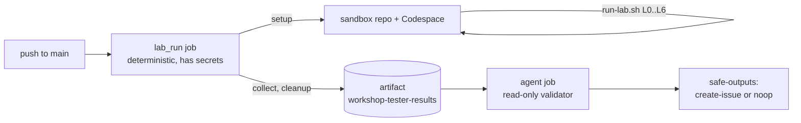

# Workshop tester: AI SDLC with GitHub and GitHub Copilot

An agentic workflow that replays the full AI SDLC with GitHub and GitHub Copilot lab ([docs/afternoon-2/workshop.md](../../../docs/afternoon-2/workshop.md)) whenever a change reaches `main`. It runs in a throwaway sandbox repository and Codespace, both deleted at the end of the run. When any step fails or the lab and its results diverge, it files a `[Workshop tester]` issue in this repository.

## How it works



| File | Runs on | Role |
| --- | --- | --- |
| [`.github/workflows/workshop-tester.md`](../../../.github/workflows/workshop-tester.md) | gh-aw source | Trigger, `lab_run` custom job, validator prompt, safe outputs. Compile with `gh aw compile workshop-tester`. |
| [`orchestrate.sh`](orchestrate.sh) | Actions runner | `setup` (snapshot of the tested commit into a private sandbox repo, Codespace creation), `run` (starts the lab and polls), `collect`, `cleanup` (always deletes the Codespace and sandbox and sweeps orphans). |
| [`run-lab.sh`](run-lab.sh) | Codespace | Executes every lab step from Level 0 to Level 6 and records one JSON line per step in `results.jsonl`. |
| [`extract-prompts.mjs`](extract-prompts.mjs) | Codespace | Reads the copy-paste prompts and L6 form values directly from `workshop.md`, so the tester uses the published text. |
| [`lib.sh`](lib.sh) | Codespace | Step and check recording, token redaction, Copilot CLI prompt replay. |

Every step has a mode that the validator reports:

- `literal`: the command is run as written in the lab.
- `translated`: same intent, adapted for a non-interactive shell (for example `copilot -p` with `--continue` instead of the chat UI, or `awk` instead of a manual edit).
- `emulated`: a UI-only action replaced by the closest CLI check (for example `/plugin` emulated with `copilot plugin list`).
- `skipped`: impossible headless (for example the VS Code fallback). It is reported, never counted as a pass.

The validator agent compares the lab's steps against the result ids to detect coverage drift. It classifies each problem as a lab defect, a solution or code defect, a product or environment change, a tester limitation, or an infrastructure failure.

## Setup

The workflow is opt-in. It does nothing until the variable below is set, so forks, attendee copies and the sandbox itself never run it.

| Kind | Name | Value |
| --- | --- | --- |
| Variable | `WORKSHOP_TESTER_ENABLED` | `true` |
| Variable (optional) | `WORKSHOP_TESTER_OWNER` | Account or organization that owns the sandbox repos. Defaults to this repository's owner. |
| Variable (optional) | `WORKSHOP_TESTER_MACHINE` | Codespace machine type. Defaults to `standardLinux32gb`. |
| Secret | `WORKSHOP_TESTER_TOKEN` | User token for a dedicated tester account with scopes `repo`, `workflow`, `delete_repo`, `codespace`. It creates and deletes the sandbox, pushes workflow files, runs `gh aw run` and assigns the issue to the Coding Agent (the assignment API requires a user token, not a GitHub App or `GITHUB_TOKEN`). |
| Secret | `WORKSHOP_TESTER_COPILOT_TOKEN` | Fine-grained PAT for the same account with the **Copilot Requests** permission, used by Copilot CLI and by the sandbox's gh-aw workflows. Falls back to `WORKSHOP_TESTER_TOKEN` if unset. |

### Token permissions

| Secret | Token type | Exact permissions | Why |
| --- | --- | --- | --- |
| `WORKSHOP_TESTER_TOKEN` | Classic PAT | `repo`, `workflow`, `delete_repo`, `codespace` | Create and push the private sandbox (including `.github/workflows`), create and delete the Codespace, delete the sandbox, run `gh aw run`, assign the issue to the Coding Agent. Fine-grained PATs cannot yet cover all of these for a user-owned sandbox created at run time. |
| `WORKSHOP_TESTER_COPILOT_TOKEN` | Fine-grained PAT | Account permission **Copilot Requests: Read** only, no repository access | Copilot CLI inference and the sandbox gh-aw engine. |

Store **both** tokens as **Actions** repository secrets (Settings > Secrets and variables > Actions). A Codespaces secret is not visible to the workflow; the orchestrator injects the Copilot token into the sandbox Codespace itself.

Hardening: issue both tokens from a dedicated bot account, not a personal account; use a short expiry and rotate; keep `WORKSHOP_TESTER_ENABLED` unset until both secrets exist.

The tester account also needs:

- A Copilot license with Copilot CLI, the Copilot Coding Agent and agentic workflows allowed by its organization policy.
- Permission to create Codespaces billed to the sandbox owner.
- The marketplace and APM sources used in the lab (`microsoft/hve-core`) reachable.

Then run it once by hand: `gh workflow run workshop-tester.lock.yml`, or `gh aw run workshop-tester`.

> [!IMPORTANT]
> gh-aw compiled this workflow in safe update mode and flagged both secrets as new restricted secrets. They are used only in the `lab_run` custom job, which runs outside the agent firewall. The agent and detection jobs never receive them and only read the uploaded artifact.

## Cost and usage

Each run consumes several independent usage units. Do not add them up as one "cost":

- **Codespaces compute and storage** for one Codespace, billed to the sandbox owner.
- **Copilot CLI usage** for the DT and RPI prompts. The run saves a `usage/*.json` per prompt (`--usage-output-file`).
- **Agentic workflow inference** for the sandbox `daily-backlog` and `a11y-review` runs and for this validator.
- **One Copilot Coding Agent session** for the Level 6 issue.
- **One Copilot code review** on the Coding Agent pull request (AI credits, plus Actions minutes on the private sandbox).
- **Actions minutes** for the runner that orchestrates the run, up to 6 hours (the lab itself is capped at 4 hours by `LAB_TIMEOUT_S`).

See the official GitHub billing documentation for current rates; this repository makes no price claims. Path filters (`docs/afternoon-2/**`, `solutions/afternoon-2/**`, `src/**`, `tests/**`, `.github/**` and the dev container) limit runs to relevant changes.

## Known limitations

- Copilot CLI prompts are model output. The checks verify the lab's acceptance criteria (endpoints, status codes, tests, files), not identical code.
- Whether `copilot -p` expands plugin prompts such as `/rpi-research`, and how `--continue` behaves with `-p`, depend on the Copilot CLI version. A failure there is reported as a tester limitation, not a lab defect.
- Level 0 Step 1 offers a template path and a copy fallback. The sandbox is a single-commit snapshot of the tested commit, which mirrors the copy fallback. The `infra-template` preflight warns while this repository is not marked as a template, because the template path then fails for participants.
- Resources are always deleted, even on failure. Debug with the `workshop-tester-results` artifact (per-step logs, Copilot session exports, gh-aw run logs, the Coding Agent PR JSON, the Copilot code review JSON).
- The Level 6 push protection demo is always recorded as skipped. It needs GitHub Secret Protection on the private sandbox, plus settings-UI steps (custom pattern and dry run) that the tester does not automate.

## Run the lab script by hand

Inside a Codespace on a scratch repository you own:

```bash
export SANDBOX_REPO=<owner>/<scratch-repo> GH_TOKEN=<token> COPILOT_GITHUB_TOKEN=<fine-grained-token>
bash tests/workshop/afternoon-2/run-lab.sh
cat /tmp/workshop-tester/summary.json
```
